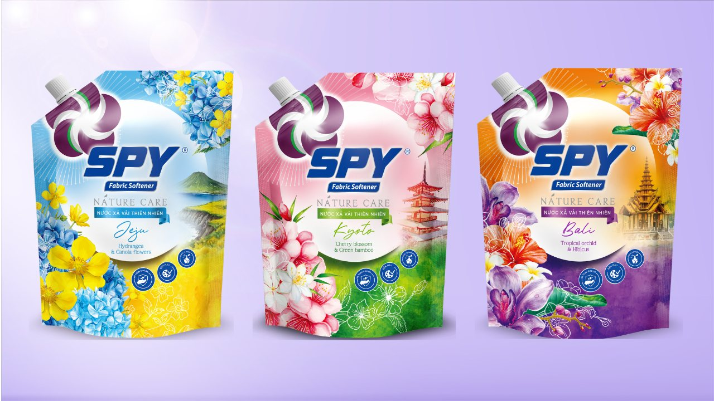
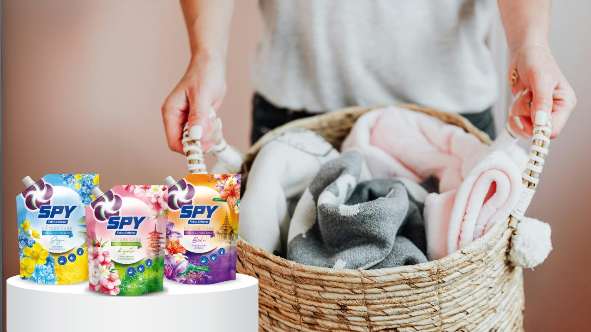
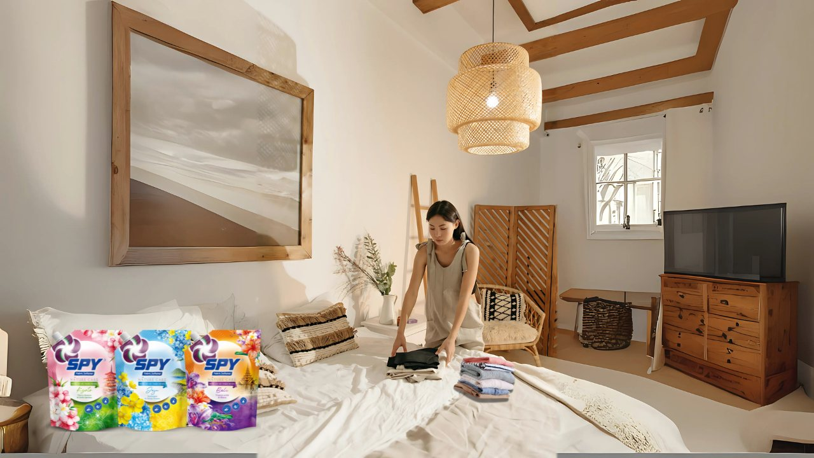

**(Trích bài viết từ báo Ngoisao.net)**

**Dòng sản phẩm nước xả vải Spy thiên nhiên gồm ba mùi hương hoa, mang lại cảm giác tinh tế, giúp người phụ nữ hiện đại chăm sóc cả gia đình.**

Đại diện nhãn hàng chia sẻ, trong nhịp sống hiện đại, người phụ nữ thường được ví như “người giữ lửa” của gia đình. Họ vừa làm việc ngoài xã hội, vừa chu toàn chuyện nhà và muốn dành thời gian cho bản thân. Nhờ có họ, mỗi thành viên gia đình trở về nhà đều tìm thấy sự an yên. Trong bức tranh hạnh phúc ấy, từng bộ quần áo sạch sẽ, mềm mại, thơm tho cũng là cách người phụ nữ gửi gắm tình yêu thương gia đình.

Đó chính là lý do để [Spy Việt Nam](https://www.facebook.com/giatxaSpy) ra mắt dòng sản phẩm Nước xả vải Spy Thiên Nhiên (Spy Nature Care) – bộ sưu tập hương hoa hoàn toàn mới, lấy cảm hứng từ thiên nhiên, mang lại sự an toàn cho da, hương thơm bền lâu và cảm giác tinh tế cho từng bộ quần áo.

*Bộ sưu tập Nước xả vải Spy Thiên Nhiên (Spy Nature Care)*

**Nước xả vải thiên nhiên chăm sóc cả gia đình**

Người phụ nữ thường có nhiều nỗi lo xoay quanh sức khỏe gia đình. Riêng quần áo, nếu giặt bằng các sản phẩm giặt giũ quá mạnh có thể gây kích ứng da, nhất là với trẻ nhỏ. Nếu hương quá nồng gắt, người mặc sẽ khó chịu. Nếu xả không kỹ, vải sẽ nhanh phai màu và trở nên thô ráp.

Spy Nature Care đã giải quyết những mối bận tâm đó bằng công thức cải tiến, giúp dưỡng chất xả thẩm thấu sâu vào từng sợi vải, phủ lên lớp màng bảo vệ. Sản phẩm chứa thành phần dịu nhẹ, lành tính.

Tin dùng nước xả vải Spy Nature Care chăm sóc quần áo cả gia đình.

 Spy Nature Care còn có nhiều công dụng khác như ngăn phai màu, giữ màu quần áo tươi mới, bền đẹp theo thời gian. Sản phẩm cũng giúp làm mềm vải, giúp dễ ủi, khiến công việc nội trợ nhẹ nhàng hơn. Hơn nữa, Spy Nature Care còn loại bỏ mùi ẩm mốc mùa mưa, mùi mồ hôi hay mùi ám từ môi trường. Nhiều chị em nhận xét, sản phẩm có hương thơm tự nhiên, không nồng gắt, mang lại cảm giác thanh mát, dễ chịu.  
Đây chính là lý do Spy Nature Care trở thành “người bạn đồng hành” tin cậy của nhiều phụ nữ Việt khi chăm sóc gia đình. Nhiều chị em chia sẻ về cảm giác an tâm khi gấp bộ đồng phục thơm mát cho con, cảm giác chăm chút khi là ủi chiếc áo sơ mi mềm mại cho chồng, hay cảm giác tự tin khi khoác lên mình chiếc váy lưu hương.

**Bộ sưu tập hương hoa** **khơi gợi** **cảm xúc**

Với phụ nữ hiện đại, hương thơm trên quần áo không chỉ là sự dễ chịu, mà còn là cách để họ khẳng định phong cách sống. Spy Nature Care đã đưa thiên nhiên vào từng giọt xả với ba mùi hương độc đáo. Trong đó, Kyoto Spring là sự kết hợp hương hoa anh đào và tre xanh, lấy cảm hứng từ mùa xuân Kyoto (Nhật Bản) thanh khiết, mát lành và tràn đầy sức sống. Jeju Garden với hương cẩm tú cầu và hoa cải dầu, lấy cảm hứng từ mùa hè ở đảo Jeju (Hàn Quốc) với không khí trong lành và sắc hoa tươi sáng mang đến sự an yên và thuần khiết. Bali Dream là sự kết hợp hương hoa lan nhiệt đới và hoa dâm bụt, lấy cảm hứng từ chuyến du ngoạn Bali, nơi tràn ngập hoa lan, hoa dâm bụt với mùi hương khó quên.

*Mỗi sản phẩm trong bộ sưu tập Nước xả vải Spy Thiên Nhiên có một mùi hương đặc trưng*

Mỗi hương thơm như một chuyến du ngoạn cảm xúc, giúp phụ nữ tận hưởng những miền đất thiên nhiên kỳ thú ngay trong tổ ấm nhỏ bé của mình.

Phụ nữ tuổi 30–45 thường ý thức rõ ràng về phong cách cá nhân. Họ có thể không chạy theo mọi xu hướng thời trang, nhưng luôn biết cách tạo dấu ấn riêng. Trong đó, hương thơm trên quần áo chính là “phụ kiện vô hình” làm nên sự khác biệt. Mùi hương Spy Nature Care không phô trương nhưng đủ để khiến người khác ghi nhớ. Trong buổi họp công việc, một bộ vest thơm nhẹ mùi Kyoto Spring sẽ giúp họ thêm tự tin. Trong bữa tiệc bạn bè, một chiếc váy lưu lại dư vị Bali Dream sẽ khiến hình ảnh của họ thêm cuốn hút.

## **Nhà máy xanh Komlife Việt Nam** **b****ảo chứng chất lượng**

Để ra được mỗi sản phẩm Spy Nature Care là cả một hệ thống sản xuất đạt chuẩn. Sản phẩm được nghiên cứu và sản xuất bởi Công ty TNHH Komlife Việt Nam, doanh nghiệp đã có hơn 15 năm kinh nghiệm trong lĩnh vực chăm sóc gia đình. Nhà máy xanh Komlife vận hành theo mô hình sản xuất thân thiện môi trường, giảm thiểu khí thải. Đại diện nhà máy cho biết, tất cả các sản phẩm đều được kiểm nghiệm để đảm bảo an toàn cho sức khỏe và chất lượng bền vững.

Dây chuyền sản xuất tại nhà máy Komlife Việt Nam

Đặt cho mình sứ mệnh “Vì một cuộc sống tốt đẹp hơn”, Komlife Việt Nam bên cạnh sản xuất sản phẩm, còn lan tỏa thông điệp về lối sống xanh toàn. [Spy Nature Care](https://www.spyvietnam.vn/) thuyết phục phụ nữ bằng hương thơm, đồng thời bằng niềm tin vào một thương hiệu uy tín.

**Trích từ bài viết “**[Bộ nước xả vải Spy hương hoa mới chăm sóc trang phục gia đình - Ngôi sao](https://ngoisao.vnexpress.net/bo-nuoc-xa-vai-spy-huong-hoa-moi-cham-soc-trang-phuc-gia-dinh-4935661.html)**”, Báo Ngoisao****net, ngày 15/09/2025.**
