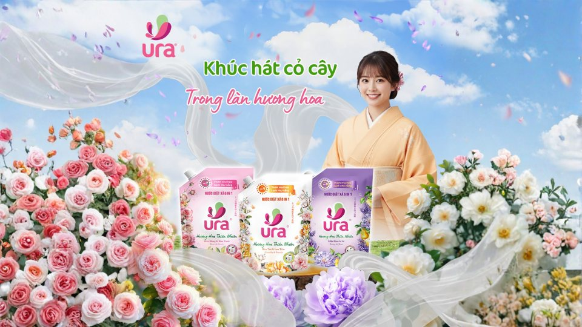
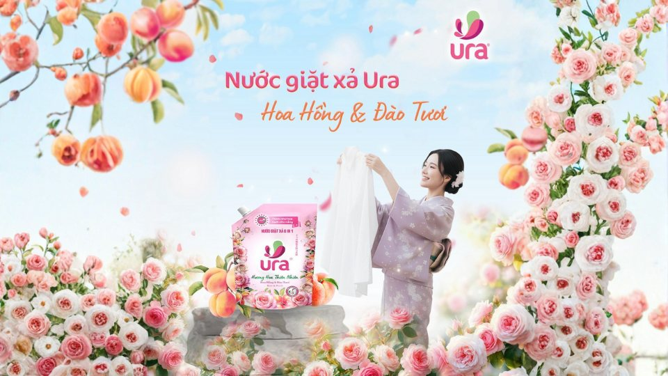
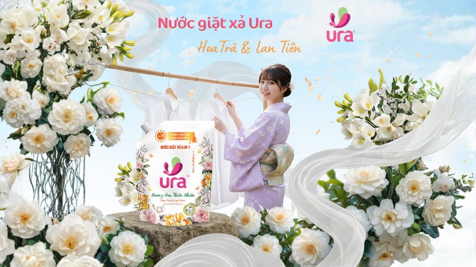
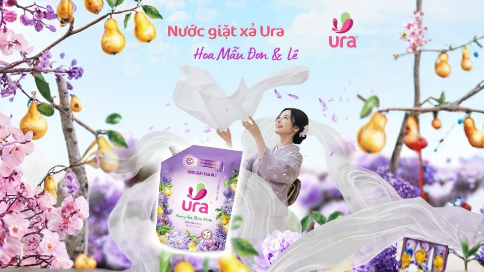

“Thơm như hoa, sạch như nắng” - không chỉ là lời hứa mà là chuẩn mực mới mà Ura muốn mang đến cho mỗi gia đình Việt. Trong từng giọt nước giặt, Ura chắt lọc tinh túy từ thiên nhiên, khiến mỗi lần giặt không chỉ là làm sạch mà còn là khoảnh khắc tận hưởng sự tươi mới và dễ chịu, khi quần áo luôn thơm tho và mềm mại như vừa đón nắng sớm.

Với Ura, giặt sạch không chỉ là loại bỏ vết bẩn mà còn là chăm sóc cảm xúc, để mùi hương trên áo quần trở thành một phần của phong thái, sự tinh tế mà người phụ nữ Việt hiện đại luôn hướng tới.

**Cảm hứng từ phong cách Floral Nhật Bản và tinh thần Kirei - Sạch sẽ, tinh khiết**  
Lấy cảm hứng từ những khu vườn Nhật Bản tràn ngập sắc hoa trong sương sớm, Ura được thiết kế với phong cách Floral - Hương hoa tự nhiên, tinh tế và sang trọng. Mỗi giọt nước giặt là sự hòa quyện giữa vẻ đẹp thuần khiết của thiên nhiên và triết lý tối giản của người Nhật, nơi từng chi tiết được tính toán tỉ mỉ để đem lại cảm giác nhẹ nhàng, thư thái trong từng chuyển động của cuộc sống.

Tinh thần Kirei - “sạch sẽ, tinh khiết trong từng giọt nước giặt”, đã trở thành linh hồn trong triết lý của Ura. Với Ura, “sạch” không chỉ là hiệu quả giặt giũ, mà là cảm giác hài hòa và tinh tế toát lên từ từng sợi vải, nơi mọi chi tiết đều được chăm chút để mang lại sự dễ chịu và cân bằng cho cuộc sống.

**Ura 6in1 - Giải pháp giặt xả toàn diện**  
Khác biệt của Ura đến từ công nghệ sạch sâu đa tầng, giúp làm sạch từ trong sợi vải, khử mùi hôi hiệu quả và giữ cho quần áo mềm mại tự nhiên. Ura không chỉ dừng lại ở hiệu quả làm sạch, mà còn mang lại trải nghiệm cảm xúc tinh tế qua bộ sưu tập hương hoa đa tầng được tạo dựng theo phong cách Floral Nhật Bản:

- Hoa mẫu đơn & Lê mọng: Sự hòa quyện giữa hương hoa mẫu đơn nồng nàn và lê mọng ngọt dịu mang cảm giác sang trọng, quyến rũ như dấu ấn riêng của người phụ nữ hiện đại.
- Hoa hồng và Đào tươi: Hương hoa hồng dịu dàng kết hợp cùng đào tươi mọng nước tạo nên làn hương ngọt ngào, rạng rỡ gợi cảm giác trong trẻo như ánh nắng ban mai.
- Lily và Hoa Cotton: Hương lily thanh nhẹ hòa cùng cotton mềm mịn, mang đến cảm giác sạch sẽ, thuần khiết và dễ chịu trên từng sợi vải.

Với Ura, mỗi hương thơm là một câu chuyện, một cảm xúc. Hành trình tạo nên Ura là hành trình tìm kiếm và chắt lọc những loại hoa tinh túy từ khắp nơi trên thế giới, để mang đến những tầng hương tươi mát, tinh tế giúp nâng tầm trải nghiệm giặt giũ mỗi ngày.

**Dịu nhẹ, an toàn, phù hợp cho mọi làn da**  
Ura không chỉ có tác dụng làm quần áo sạch thơm mà còn hướng đến sự an toàn và cảm giác dịu nhẹ cho người sử dụng. Với chiết xuất thiên nhiên thân thiện với làn da, kể cả da nhạy cảm, Ura giúp loại bỏ hoàn toàn cặn bẩn mà không để lại tồn dư hóa chất, đồng thời giảm thiểu kích ứng, kể cả với làn da nhạy cảm. Công thức giặt - xả - lưu hương trong một bước duy nhất giúp tiết kiệm thời gian mà vẫn đảm bảo hiệu quả vượt trội - mang đến cảm giác an tâm, thoải mái và tiện lợi trong mỗi lần sử dụng.

Ura không chỉ chăm sóc quần áo mà còn là người bạn đồng hành tin cậy trong hành trình vun đắp một mái ấm sạch thơm và đầy yêu thương

**Ura - Chuẩn sạch mới cho cuộc sống hiện đại**  
Được phát triển bởi công ty TNHH Komlife Việt Nam, Ura là sự kết hợp giữa công nghệ giặt xả hiện đại và triết lý sống thanh lịch, tinh tế - nơi hiệu quả làm sạch được nâng tầm thành nghệ thuật chăm sóc. Không ngừng nghiên cứu và đổi mới, Komlife mong muốn mỗi sản phẩm của Ura không chỉ đơn thuần là giải pháp giặt giũ mà còn là một phần trong phong cách sống hiện đại.  
Ura hướng đến người phụ nữ Việt - những người luôn biết cách chăm chút cho tổ ấm, cho bản thân và cho những điều nhỏ bé làm nên hạnh phúc. Mỗi sản phẩm tạo ra đều thể hiện trọn vẹn tinh thần Kirei - Vẻ đẹp thật sự bắt đầu từ sự sạch sẽ và tinh tế. Đó là niềm tin và cũng là kim chỉ nam trong hành trình phát triển của Ura. Từ công nghệ, mùi hương đến thiết kế, mọi yếu tố đều được chọn lọc kỹ lưỡng - để khi lựa chọn Ura, người phụ nữ không chỉ chọn một loại nước giặt xả mà chọn một phong thái sống nhẹ nhàng, thanh lịch và tinh tế.

Đã đến lúc biến việc giặt giũ mỗi ngày thành khoảnh khắc tận hưởng sự tinh tế và dễ chịu. Hãy để Ura đồng hành cùng bạn trong hành trình mang lại sự sạch sẽ, dịu nhẹ và hương hoa tinh tế cho cả gia đình. Trải nghiệm ngay sản phẩm tại các điểm bán hay hệ thống phân phối chính thức của Komlife Việt Nam, hoặc đặt hàng trực tuyến qua Shopee và Tiktok Shop chính thức của Komlife Việt Nam.
