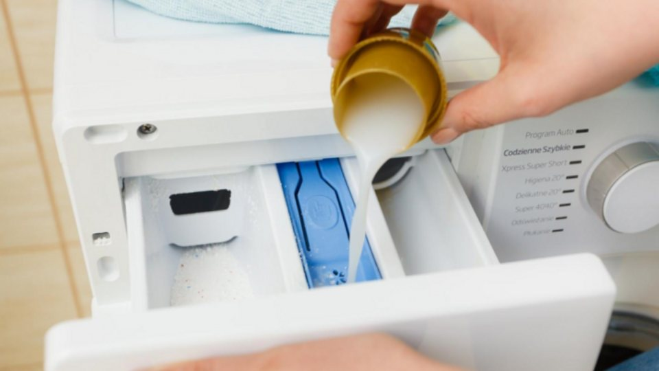

**(Trích bài viết từ báo VTCNews)**

Với quỹ thời gian hạn hẹp, việc phân bổ thời gian vẹn toàn giữa chăm sóc gia đình và chu toàn kinh tế đôi khi gây áp lực lớn đến phụ nữ hiện đại, nhất là những ngày đi làm về mệt mỏi về đến nhà lại phải gồng mình với công việc nhà và xử lý giỏ quần áo bẩn ngổn ngang chất cao như núi. Chọn nước giặt rồi nước xả, phân loại quần áo, ngâm trước giặt tay đồ trắng nhiều vết bẩn, chọn chỗ phơi đồ đón ánh nắng trực tiếp….

Việc giặt giũ hàng ngày cũng tốn nhiều thời gian của phụ nữ hiện đại, vì vậy lựa chọn sử dụng các sản phẩm giặt giũ tiết kiệm và hiệu quả là ưu tiên hàng đầu của các bà nội trợ thông thái.

Hiểu được điều đó, Thương hiệu Spy với 15 năm kinh nghiệm chăm sóc gia đình Việt cho ra mắt sản phẩm Nước giặt xả Ultra Clean Plus 5,2kg – một giải pháp giặt giũ thông minh, giúp tiết kiệm thời gian, công sức và chi phí.

Nước giặt xả SPY 6in1 - giải pháp cho gia đình hiện đại.

**Công thức đậm đặc, hiệu quả vượt trội**

Điểm nổi bật của Nước giặt xả Ultra Clean Plus chính là công thức đậm đặc, chỉ cần sử dụng một lượng nhỏ Nước giặt xả Ultra Clean Plus cho mỗi lần giặt, giúp tiết kiệm đến 50% so với các sản phẩm thông thường, dung tích lớn với can 5,2kg chỉ với 50-70ml nước giặt bạn đã có thể giặt được 5-7kg quần áo hàng ngày. Điều này không chỉ giúp bạn tiết kiệm chi phí mà còn giảm thiểu tác động đến môi trường.

Công thức đậm đặc – tiết kiệm tối đa cho người tiêu dùng.

Nếu lúc trước khi giặt giũ phải sử dụng nhiều nước giặt cho 1 chu trình giặt để quần áo sạch hơn thì giờ đây, giặt giũ với Nước giặt xả Ultra Clean Plus sẽ tiết kiệm 1 nửa chi phí nhờ sở hữu công thức đậm đặc, chứa các thành phần làm sạch tự nhiên, giúp loại bỏ mọi vết bẩn cứng đầu như dầu mỡ, mồ hôi, thậm chí cả vết ố vàng trên quần áo trắng. Bên cạnh đó, sản phẩm còn có khả năng bảo vệ sợi vải, giúp quần áo luôn mềm mại, bền màu và giữ được độ mới lâu hơn.

**Mùi hương quyến rũ, lưu giữ lâu dài**

Nước giặt xả Ultra Clean Plus mang đến cho quần áo hương thơm nước hoa Pháp sang trọng, tinh tế, giúp bạn luôn cảm thấy tự tin và thoải mái khi diện những bộ đồ thơm ngát. Hương thơm bám bền lâu trên quần áo, lưu hương đến 7 ngày sau khi giặt.

Hương nước hoa Pháp lưu bền lâu trên áo quần.

**An toàn cho da và thân thiện với môi trường**

Sản phẩm được sản xuất bởi Nhà máy xanh Komlife Việt Nam trên dây chuyền công nghệ hiện đại, đảm bảo an toàn cho da, không gây kích ứng, phù hợp với mọi loại vải, kể cả vải sợi tổng hợp và vải sợi tự nhiên. Bên cạnh đó, Nước giặt xả Ultra Clean Plus còn được sản xuất từ các thành phần thân thiện với môi trường, không chứa chất độc hại, giúp bảo vệ sức khỏe cho cả gia đình.

*“Tình yêu với gia đình của phụ nữ hiện đại được thể hiện qua nhiều điều, có những điều tuy nhỏ nhưng mang ý nghĩa lớn, trong đó có bộ quần áo trắng thơm của bé con mỗi khi đi học, áo sơ mi lúc nào cũng thơm tho, phẳng phiu của chồng mặc đến cơ quan. Với sự hỗ trợ đắc lực từ Spy, những điều này trở nên dễ dàng để thực hiện mỗi ngày mang đến sự quan tâm và chăm sóc chu toàn cho gia đình nhỏ”,* một khách hàng của SPY chia sẻ.

Nước giặt xả Ultra Clean Plus là sự lựa chọn tối ưu cho những gia đình hiện đại, bận rộn. Với những ưu điểm vượt trội như đậm đặc, tiết kiệm, hiệu quả làm sạch cao, mùi hương sang trọng và an toàn cho da, Ultra Clean Plus chắc chắn sẽ làm hài lòng ngay cả những bà nội trợ khó tính nhất.

Người tiêu dùng có thể tìm mua Nước giặt xả Ultra Clean Plus tại các cửa hàng tạp hóa, hệ thống siêu thị trên toàn quốc hoặc chọn mua từ các kênh phân phối trực tuyến.

**Trích từ bài viết “**[Giặt xả tiết kiệm - giải pháp cho gia đình hiện đại](https://vtcnews.vn/giat-xa-tiet-kiem-giai-phap-cho-gia-dinh-hien-dai-ar922219.html)**”, Báo VTCNews, ngày 24/01/2025.**
