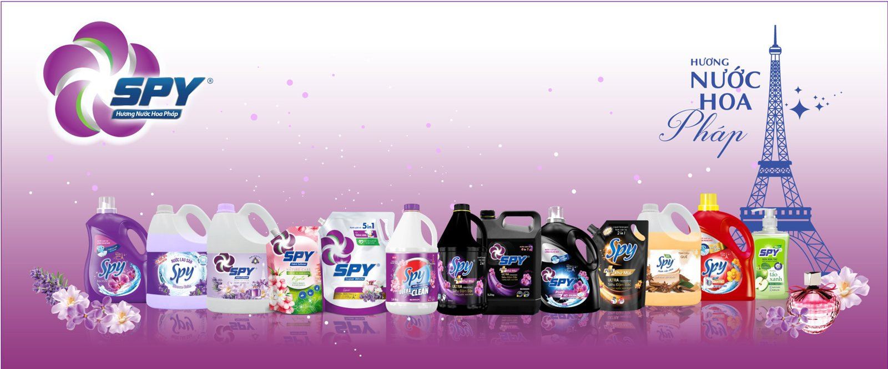

Hương thơm nước giặt không chỉ tạo cảm giác dễ chịu mà còn là yếu tố then chốt quyết định người tiêu dùng có trung thành với một thương hiệu hay không. Với người tiêu dùng hiện đại, mùi hương là yếu tố quan trọng hàng đầu khi lựa chọn nước giặt – đôi khi còn quan trọng hơn cả khả năng giặt sạch.

## **Vì sao hương thơm lại quan trọng đến vậy?**

### Mang lại cảm giác sạch sẽ và dễ chịu

*Mùi hương nhẹ nhàng, thanh thoát từ quần áo giúp người mặc cảm thấy sảng khoái, thư giãn hơn – như vừa bước ra từ một tiệm giặt là cao cấp.*

### Tạo dấu ấn cá nhân

*Mùi hương còn là cách để người mặc thể hiện cá tính – sang trọng, quyến rũ hay tươi mới, hiện đại – mà không cần dùng nước hoa.*

### Loại bỏ cảm giác “mùi hôi” sau giặt

### Hương thơm giữ lại lâu trên quần áo giúp át đi các mùi ẩm, mốc hoặc khó chịu – đặc biệt vào mùa nồm ẩm.

## **Các nhà sản xuất chọn hương nước giặt như thế nào?**

Việc phát triển một mùi hương cho nước giặt là cả một quá trình nghiên cứu – thử nghiệm – điều chỉnh rất công phu. Các yếu tố được cân nhắc gồm:

- Phản hồi thị trường: khảo sát thói quen và sở thích hương thơm theo vùng miền, nhóm tuổi, phong cách sống.
- Tính ổn định của mùi: phải giữ được hương trên vải sau nhiều giờ, thậm chí sau khi phơi.
- Tính an toàn: không gây dị ứng, kể cả với làn da nhạy cảm.
- Tính tương thích: không bị biến mùi khi kết hợp với các thành phần tẩy rửa.

## **Komlife Việt Nam và hành trình chắt lọc hương hoa Pháp vào từng giọt nước giặt**

Có bao giờ bạn tự hỏi: Làm sao một thương hiệu Việt như Komlife có thể tạo ra những dòng nước giặt mang đậm phong cách Pháp – sang trọng, tinh tế và lưu hương dài lâu?

Câu trả lời nằm ở sự đầu tư bài bản và nghiên cứu chuyên sâu:

- Komlife Việt Nam hợp tác cùng các chuyên gia hương liệu châu Âu để chọn lọc ra những nốt hương đặc trưng, dễ tạo thiện cảm và phù hợp với khí hậu Việt Nam.
- Mỗi dòng sản phẩm đều được thử nghiệm khắt khe để đảm bảo: giặt sạch – an toàn – lưu hương bền lâu.

*Các sản phẩm do Komlife Việt Nam sản xuất  không chỉ đơn thuần là một sản phẩm giặt giũ – đó là một trải nghiệm mùi hương. Nếu bạn mong muốn việc giặt giũ hàng ngày không chỉ sạch mà còn đem lại cảm giác thoải mái, thì Komlife Việt Nam chính là người bạn đồng hành – từ công nghệ làm sạch sâu cho đến hương thơm tinh tế lưu lại trên từng sợi vải.*

**“Komlife Việt Nam – Vì một cuộc sống tốt đẹp hơn”.**
