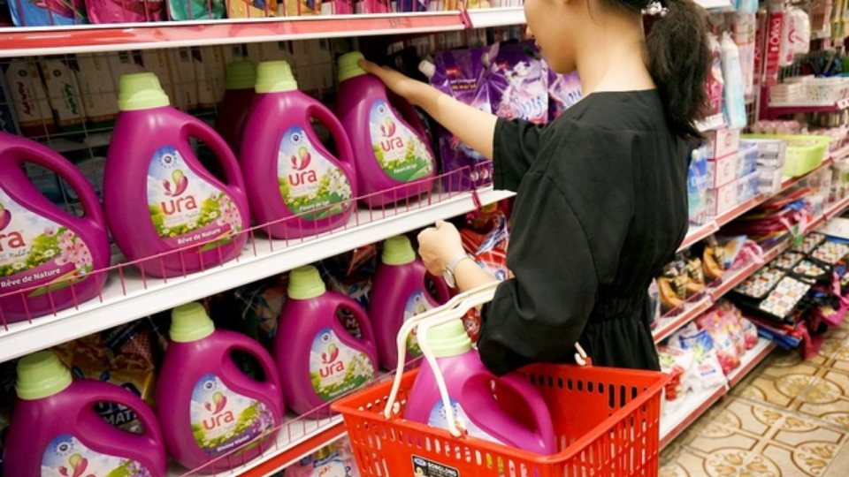
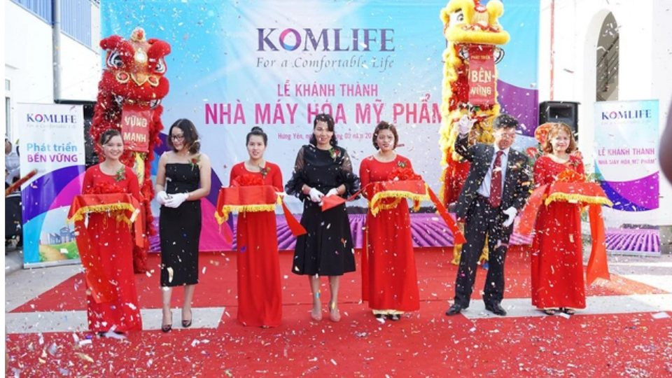
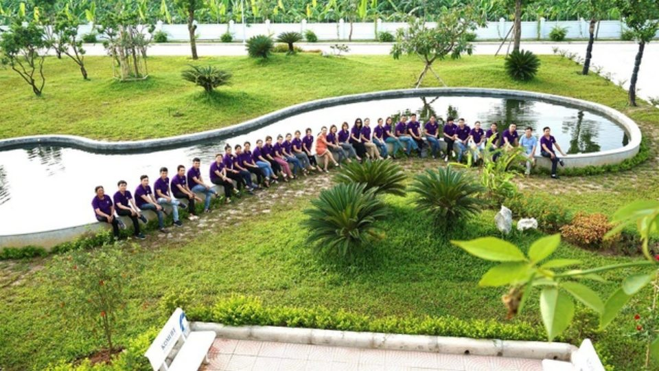

**(Trích bài viết từ báo Gia đình & Xã hội)**

## Thị trường xà phòng, nước giặt xả nói riêng và hàng tiêu dùng trong nước nói chung nhiều năm nay được chi phối bởi các tập đoàn đa quốc gia với những thương hiệu mạnh nổi tiếng thường xuất hiện trên truyền hình như: Omo, Surf, Ariel, Tide, ... Tuy nhiên, một doanh nghiệp Việt Nam vẫn vươn lên đạt được thị phần không nhỏ và giành được lòng tin yêu của khách hàng trong 10 năm qua. Đó chính là công ty TNHH Komlife Việt Nam với các sản phẩm nước giặt xả SPY, URA, ABBY, ...

**Từ con số không tiến đến bao phủ toàn quốc**

Thành lập từ năm 2010, giữa lúc thị trường đang tràn ngập các loại bột giặt "trắng hơn, sáng hơn", đội ngũ sáng lập KOMLIFE Việt Nam đã sớm nhìn ra nhu cầu không nhỏ của người tiêu dùng về một loại nước giặt giúp giặt sạch mà phải thơm lâu, mềm vải. Ý tưởng sản xuất nước giặt xả hương nước hoa Pháp bắt nguồn từ đó.

Tốn không ít thời gian và tâm huyết để có thể tìm ra được loại nước giặt trắng sạch, thơm lâu, phù hợp với điều kiện khí hậu nóng ẩm của Việt Nam, những can nước giặt xả SPY đầu tiên đã ra đời.

Hành trình chinh phục thị trường khởi đầu vô cùng gian nan, vất vả. Nhân viên bán hàng tới thuyết phục từng cửa hàng, từng gia đình dùng thử sản phẩm và trải nghiệm. Cứ thế mà đơn đặt hàng tăng lên gấp trăm ngàn lần. Người tiêu dùng truyền tai nhau về loại nước giặt xả SPY thơm lâu suốt 7 ngày.

Tròn 10 năm phát triển, đến nay, KOMLIFE Việt Nam đã đạt được thị phần đáng kể trên bản đồ nước giặt xả trong nước. Các sản phẩm mang thương hiệu SPY, URA, ABBY, SAFY có mặt tại hầu hết cả cửa hàng, siêu thị khắp ba miền, từ thành thị đến nông thôn, từ miền núi tới miền biển.

**Mở rộng sản xuất, chuẩn hóa chất lượng**

Nhu cầu tiêu thụ sản phẩm ngày càng lớn, công ty KOMLIFE Việt Nam buộc phải mở rộng quy mô sản xuất. Năm 2017, công ty khởi công nhà máy hóa mỹ phẩm công suất 45.000 tấn tại thôn Từ Hồ, xã Yên Phú, huyện Yên Mỹ, tỉnh Hưng Yên.

Nhà máy KOMLIFE Hưng Yên được đầu tư bài bản nhà xưởng, kho bãi, hệ thống xử lý nước sạch, nước thải. Đến nay, nhà máy được biết đến với cái tên "Nhà máy xanh" bởi khuôn viên ngập tràn hoa lá và quy trình sản xuất "sạch", thân thiện môi trường.

Ngày 19 tháng 05 vừa qua, nhà máy KOMLIFE Việt Nam được cấp chứng nhận ISO 9001:2015 và ISO 14001:2015. Đây là hai chứng nhận quốc tế về quản lý chất lượng và quản lý môi trường.

Hai chứng chỉ ISO là lời khẳng định rõ ràng nhất về cam kết, tầm nhìn, và thực thi của đội ngũ lãnh đạo công ty KOMLIFE Việt Nam trên con đường đem tới tay khách hàng những sản phẩm chất lượng tốt và giá thành phải chăng.

KOMLIFE luôn tiên phong ứng dụng những thành quả nghiên cứu khoa học tiên tiến, đổi mới công thức sản phẩm, lựa chọn thành phần an toàn cho sức khỏe, thân thiện môi trường. Đối tác nguyên liệu của công ty đều là các tập đoàn hóa chất, hương liệu lớn trên thế giới như Mane (Pháp), Kao (Nhật Bản), BASF (Đức), Givaudan (Thụy Sỹ),...

Có thể khẳng định, các sản phẩm Nước giặt xả SPY, URA, ABBY, Nước rửa chén SAFY sản xuất bởi nhà máy KOMLIFE Hưng Yên đạt tiêu chuẩn quốc tế từ nguyên vật liệu đến quy trình sản xuất và kiểm soát chất lượng.

**Phát triển bền vững , vươn tầm quốc tế**

Giữ vững phương châm luôn cải tiến không ngừng, đi đầu đổi mới chất lượng sản phẩm, mục tiêu của KOMLIFE Việt Nam là vươn ra thị trường quốc tế.

Nhờ vận dụng được tinh thần hợp sức của cán bộ công nhân viên cùng cam kết đồng hành từ các đối tác nước ngoài, KOMLIFE đang bước từng bước vững chắc trên con đường phát triển và hội nhập.

KOMLIFE là trường hợp điển hình cho lớp doanh nghiệp vừa và nhỏ của Việt Nam không ngừng nỗ lực, kiên trì khẳng định chất lượng Việt, khát vọng vươn tầm quốc tế. Đúng như Slogan của công ty: " For a comfortable life - Vì một cuộc sống tốt đẹp hơn "

**Trích từ bài viết “**[Komlife Việt Nam - 10 năm chinh phục gia đình Việt](https://giadinh.suckhoedoisong.vn/komlife-viet-nam-10-nam-chinh-phuc-gia-dinh-viet-172200610082906788.htm)**”, Báo Gia đình & Xã hội****, ngày 10/06/2020.**
