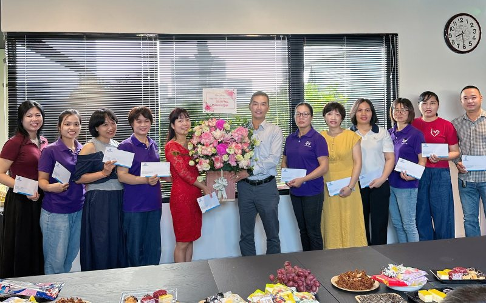
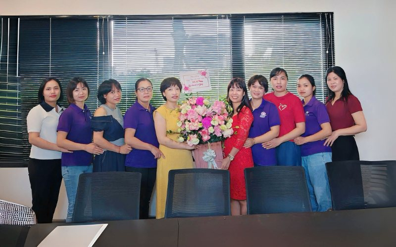
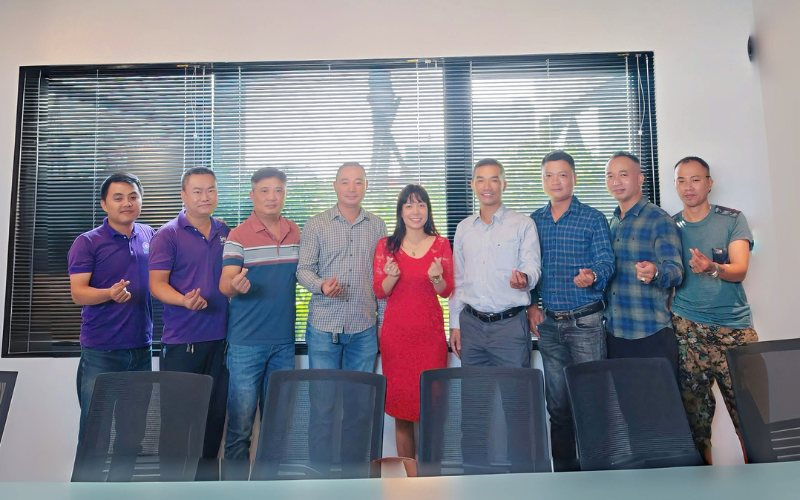
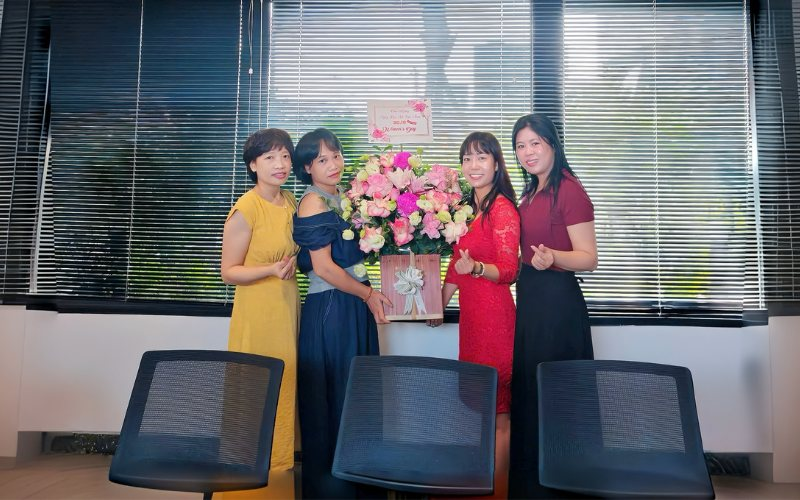
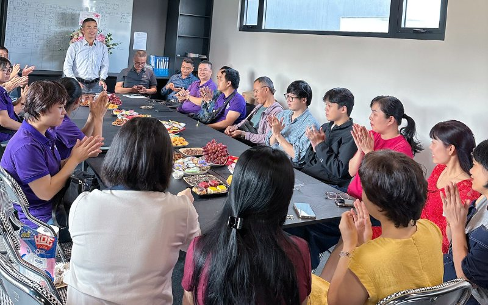

Ngày Phụ nữ Việt Nam 20/10 luôn là dịp đặc biệt để tri ân và tôn vinh những người phụ nữ Việt Nam - những người vẫn miệt mài cống hiến, lặng lẽ vun đắp cho gia đình, xã hội và cả trong công việc. Tại Komlife Việt Nam, đội ngũ nữ nhân sự không chỉ góp phần tạo nên hiệu quả trong hoạt động kinh doanh mà còn lan tỏa tinh thần gắn kết, sự tinh tế và mềm mỏng trong văn hóa nội bộ.

Với tinh thần trân trọng và sẻ chia, Komlife Việt Nam đã tổ chức một buổi gặp mặt thân mật nhân dịp 20/10, như một lời cảm ơn chân thành gửi tới toàn thể các chị em đang đồng hành cùng doanh nghiệp.

**Buổi gặp mặt nhỏ nhưng ấm áp và chu đáo**

Sự kiện được tổ chức nhẹ nhàng với bánh ngọt, kẹo, trái cây và trà nước. Không gian được trang trí giản dị, tinh tế nhưng vẫn toát lên sự ấm cúng, thân thuộc. Chính sự mộc mạc ấy lại mang đến cảm giác gần gũi, đúng với tinh thần của một buổi gặp mặt nội bộ đầy ý nghĩa.

Mọi người có dịp ngồi lại bên nhau, cùng trò chuyện, chia sẻ những câu chuyện nhỏ trong công việc và cuộc sống. Giữa nhịp sống bận rộn, những phút giây tạm gác lại công việc để cùng nhau thưởng trà, trao nhau nụ cười chính là khoảng thời gian quý giá giúp kết nối mọi người và lan tỏa năng lượng tích cực trong tập thể.

**Lời chúc gửi gắm bằng sự trân trọng**

Mở đầu buổi gặp mặt, đại diện Ban lãnh đạo Komlife Việt Nam đã gửi lời chúc mừng nồng nhiệt đến toàn thể nhân viên nữ. Những chia sẻ ngắn gọn nhưng sâu sắc đã thể hiện rõ thông điệp: phụ nữ trong Komlife không chỉ là những cộng sự tận tâm trong công việc, mà còn là những người truyền cảm hứng, giữ vai trò quan trọng trong việc xây dựng văn hóa ứng xử và tinh thần đoàn kết của doanh nghiệp.

Ban lãnh đạo cũng bày tỏ lòng cảm ơn trước tinh thần làm việc trách nhiệm, sự bền bỉ và cống hiến thầm lặng của các chị em trong hành trình phát triển chung. Những lời chúc chân thành, giản dị nhưng đầy ý nghĩa đã giúp buổi gặp mặt thêm phần ấm áp và giàu cảm xúc.

**Hoa và món quà nhỏ - gửi gắm niềm tri ân**

Nhân dịp đặc biệt này, đại diện Ban lãnh đạo Komlife Việt Nam đã trao tặng hoa thay lời tri ân và cảm ơn sâu sắc đến toàn thể các chị em trong công ty. Bên cạnh đó là những phần quà nhỏ được chuẩn bị chu đáo thể hiện sự quan tâm và ghi nhận của tập thể đối với những nỗ lực, cống hiến thầm lặng của các nhân sự nữ trong suốt thời gian qua.

Từng món quà nhỏ được gửi gắm với sự tinh tế và trân trọng - như cách Komlife Việt Nam thể hiện lòng biết ơn một cách nhẹ nhàng nhưng sâu sắc. Những nụ cười, ánh mắt xúc động trong khoảnh khắc ấy đã khiến không gian buổi gặp mặt thêm phần rộn ràng và ấm lòng.

**Kết nối từ những điều giản dị**

Công tác chuẩn bị cho buổi gặp mặt được thực hiện chu đáo với sự chung tay của Komlife Việt Nam. Từ việc sắp xếp không gian, chuẩn bị trà bánh đến khâu tặng quà - mọi chi tiết đều thể hiện tinh thần đồng hành, trách nhiệm và tôn trọng lẫn nhau.

Không cần đến sân khấu lớn hay những tiết mục cầu kỳ, chính sự giản dị và chân thành đã khiến buổi gặp gỡ trở nên thân mật, gắn kết - đúng với tinh thần mà Komlife luôn hướng tới.  
Buổi gặp gỡ không chỉ là dịp để chúc mừng ngày 20/10, mà còn là cơ hội để các thành viên thêm thấu hiểu và gần gũi hơn. Những cuộc trò chuyện nhỏ, tiếng cười và lời chúc tốt đẹp đã trở thành cầu nối gắn kết mọi người trong tập thể.

**Lan tỏa giá trị từ nội bộ**

Sự kiện 20/10 năm nay một lần nữa thể hiện rõ định hướng nhân văn trong văn hóa doanh nghiệp của Komlife Việt Nam: lấy con người làm trung tâm, đề cao sự ghi nhận và tạo điều kiện để mỗi cá nhân đều cảm thấy được trân trọng.  
Không chỉ là một buổi gặp mặt kỷ niệm, đây còn là dịp để Komlife lan tỏa tinh thần sẻ chia và gắn kết - nơi mỗi thành viên cảm nhận được sự quan tâm, thấu hiểu và tình cảm chân thành đến từ tập thể.  
Buổi gặp mặt chúc mừng Ngày Phụ nữ Việt Nam 20/10 do Komlife Việt Nam tổ chức đã khép lại trong không khí ấm áp, vui tươi và đầy yêu thương. Komlife đã lan tỏa thông điệp nhân văn sâu sắc: mỗi người phụ nữ trong tập thể đều xứng đáng được trân trọng và tôn vinh.  
Đó không chỉ là lời chúc mừng, mà còn là cam kết về cách Komlife luôn hướng tới - một doanh nghiệp phát triển bền vững, bắt đầu từ sự quan tâm chân thành dành cho các cán bộ nhân viên.
