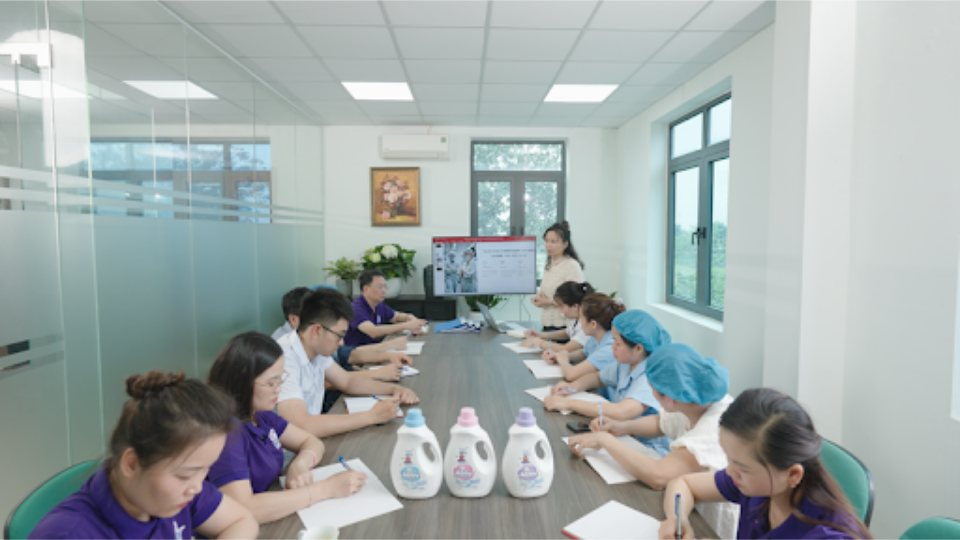
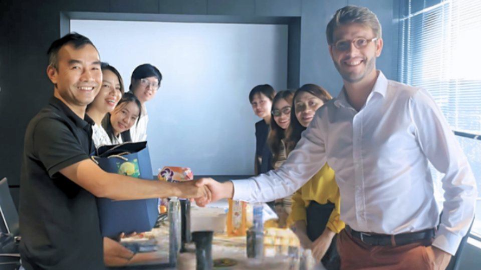
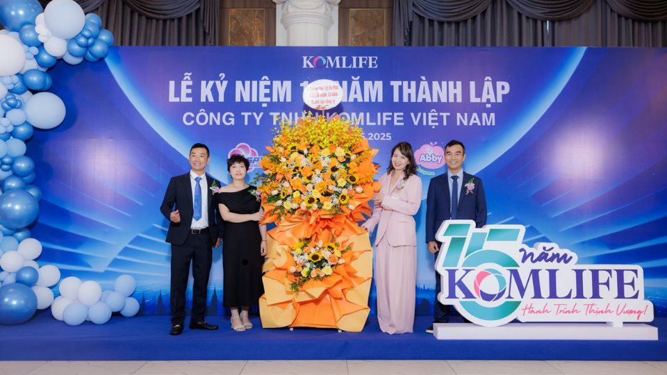
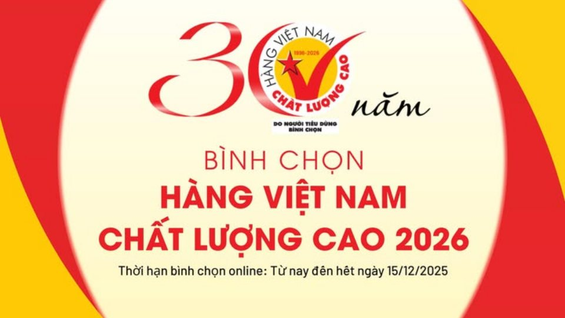

Trong suốt hơn một thập kỷ qua, Komlife đã khẳng định vị thế của một thương hiệu Việt vững mạnh trên thị trường hóa – mỹ phẩm, không chỉ với dây chuyền sản xuất hiện đại, phòng lab tiên tiến, mà quan trọng hơn, bằng chất lượng sản phẩm được hàng triệu người tiêu dùng tin tưởng, giúp Komlife có tên trong danh sách “Hàng Việt Nam Chất Lượng Cao” — minh chứng cho khát vọng: “Người Việt xứng đáng được sử dụng sản phẩm an toàn, chất lượng quốc tế, do chính người Việt tạo nên.”

# **KHỞI ĐẦU TỪ KHÁT VỌNG VIỆT**

Và để hiện thực hóa khát vọng ấy, hành trình của Komlife đã bắt đầu từ một khởi nguồn đầy gian nan nhưng cũng rất đỗi tự hào. "Komlife Việt Nam được thành lập năm 2010 bởi bà Trần Thị Huyên và ông Nguyễn Mạnh Cường, khi thị trường hàng tiêu dùng nhanh trong nước vẫn đang bị “bao phủ” bởi các thương hiệu ngoại nhập. Khi ấy, ý tưởng về một thương hiệu Việt tự chủ công nghệ, kiểm soát nguyên liệu và tiêu chuẩn chất lượng quốc tế vẫn còn là điều ít người tin tưởng.  
Thế nhưng, với niềm đam mê hóa – mỹ phẩm và tinh thần học hỏi không ngừng, những người sáng lập Komlife đã bắt đầu hành trình từ một xưởng nhỏ, chỉ vài chục con người, nhưng với niềm tin lớn và khát vọng mang sản phẩm chất lượng đến tay mỗi gia đình Việt.  
  
Chính nhờ sự kiên định ấy, Komlife đã trở thành một trong những doanh nghiệp nội địa hiếm hoi được người tiêu dùng bình chọn vào danh sách “Hàng Việt Nam Chất Lượng Cao”. Danh hiệu này sẽ không chỉ là giải thưởng, mà còn là bằng chứng sống động cho niềm tin của hàng triệu gia đình Việt vào chất lượng, an toàn và tâm huyết mà thương hiệu Komlife mang đến.  
  
Đây là minh chứng rõ ràng rằng, khi thương hiệu Việt làm bằng tâm – bằng chất lượng thật, khát vọng Việt hoàn toàn có thể vươn lên, được cả thị trường và người tiêu dùng công nhận.

# **BƯỚC NGOẶT CÔNG NGHIỆP HOÁ - KOMLIFE TIẾN TỚI “HÀNG VIỆT NAM CHẤT LƯỢNG CAO”**

Năm 2018 đánh dấu một bước ngoặt quan trọng trong hành trình Komlife, khi nhà máy tại Hưng Yên chính thức đi vào hoạt động với diện tích hơn 20.000m², áp dụng quy trình sản xuất khép kín, công nghệ cao và đạt tiêu chuẩn ISO quốc tế.  
Nguyên liệu được nhập khẩu từ các tập đoàn hóa chất hàng đầu thế giới như Mane – Pháp, Givaudan – Thụy Sĩ, BASF – Mỹ, Kao – Nhật Bản, nhằm đảm bảo chất lượng vượt trội cho các thương hiệu được ra mắt thị trường:  
**URA** – Nước giặt xả và nước rửa chén cao cấp, vừa bọt – sạch nhanh – thơm lâu, thân thiện với da tay và môi trường.  
**SPY** – Nước lau sàn, tẩy rửa đa năng, nước giặt hương thơm Pháp hiệu quả mạnh mẽ nhưng vẫn an toàn cho cả gia đình.  
**ABBY** – Bộ sản phẩm chăm sóc cá nhân dịu nhẹ, đặc biệt dành cho phụ nữ và trẻ nhỏ.  
**GIVEBE** – Dòng sản phẩm sữa tắm trẻ trung, năng động, phù hợp lối sống hiện đại, yêu sự tiện lợi.  
**EDDY** – Sản phẩm vệ sinh và chăm sóc nhà cửa thông minh, tập trung vào tiện dụng và hương thơm tinh tế.  
  
Mỗi bước đi đều được Komlife đầu tư bài bản, từ công nghệ đến nguyên liệu, từ quy trình đến nhân lực, thể hiện cam kết nghiêm túc với chất lượng sản phẩm đạt tiêu chuẩn quốc tế. Các chứng nhận quan trọng như ISO 9001:2015, ISO 14001:2015, JIS chính là minh chứng cho năng lực sản xuất an toàn, chính xác và uy tín của thương hiệu.  
  
Nhờ chất lượng vượt trội và niềm tin của người tiêu dùng, Komlife nằm trong danh sách bình chọn “Hàng Việt Nam Chất Lượng Cao”, trở thành một trong những doanh nghiệp nội địa tiên phong trong lĩnh vực hóa – mỹ phẩm. Đây không chỉ là giải thưởng, mà là bằng chứng rõ ràng cho sự công nhận của thị trường và lòng tin của hàng triệu gia đình Việt.

Cho đến nay, Komlife sở hữu mạng lưới phân phối phủ khắp 63 tỉnh thành, hàng triệu sản phẩm được tiêu thụ mỗi năm. Không dừng lại ở đó, Komlife còn đầu tư mạnh mẽ vào R&D, công nghệ sinh học, nguyên liệu tự nhiên an toàn, đồng thời thực hiện các định hướng phát triển bền vững:  
- Công nghệ xanh, tiết kiệm năng lượng và giảm phát thải.  
- Bao bì tái chế, góp phần bảo vệ môi trường.  
- Chuyển đổi số, nâng cao năng suất và minh bạch chuỗi cung ứng.  
- Phát triển con người, tạo môi trường làm việc gắn bó, sáng tạo và nhân văn.

# **KOMLIFE - TỰ HÀO THƯƠNG HIỆU VIỆT - HÀNG VIỆT NAM CHẤT LƯỢNG CAO**

Mỗi sản phẩm Komlife đến tay người tiêu dùng là sản phẩm được tạo ra từ chất lượng, niềm tin và tâm huyết, góp phần khẳng định vị thế thương hiệu Việt, vươn tầm quốc tế, đồng thời luôn hướng tới danh hiệu Hàng Việt Nam Chất Lượng Cao — một niềm tự hào cho cả đội ngũ Komlife và cộng đồng người Việt.  
“Mỗi giọt nước giặt, mỗi hương thơm lan tỏa không chỉ là kết quả của công nghệ, mà còn là tình yêu và tâm huyết của những con người Komlife – những người tin rằng: tử tế cũng có thể làm nên thương hiệu lớn.”  
🌿 Komlife Việt Nam – Vì một cuộc sống tốt đẹp hơn.

Và giờ đây, hành trình của Komlife lại cần thêm một cột mốc ý nghĩa – một cột mốc do chính những người tiêu dùng Việt đồng hành cùng Komlife viết nên!  
  
**KOMLIFE ĐANG THAM GIA BÌNH CHỌN "HÀNG VIỆT NAM CHẤT LƯỢNG CAO"!**  
Sự tin yêu và ủng hộ của Quý khách hàng chính là động lực lớn nhất giúp Komlife không ngừng phát triển và khẳng định vị thế. Hôm nay, chúng tôi kính mong nhận được sự đồng hành của bạn một lần nữa!  
**HÃY BÌNH CHỌN NGAY cho Komlife tại đường link phía dưới để tiếp tục chung tay nâng cao vị thế hàng Việt Nam chất lượng, an toàn cho mọi gia đình!**  
<https://hvnclc.vn/khao-sat-binh-chon-hang-viet-nam-chat-luong-cao-2026/>  
Mỗi lá phiếu của bạn không chỉ là sự ghi nhận, mà còn là niềm tin, là tự hào, và là nguồn sức mạnh để thương hiệu Việt tiếp tục vươn xa.

Trân trọng cảm ơn và mong chờ sự đồng hành của bạn!
