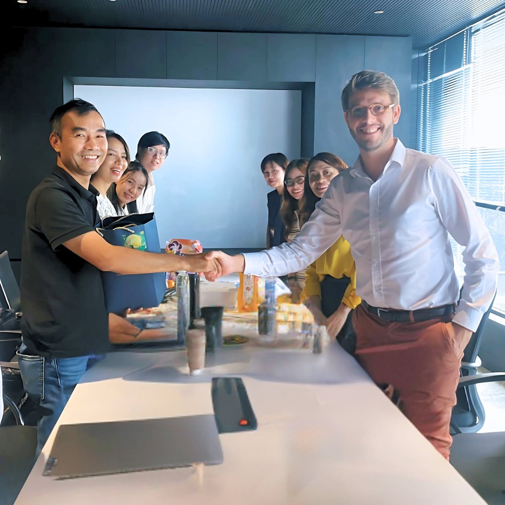
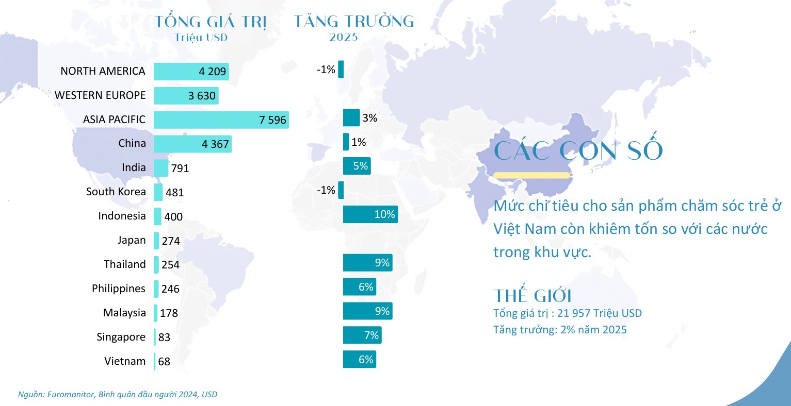
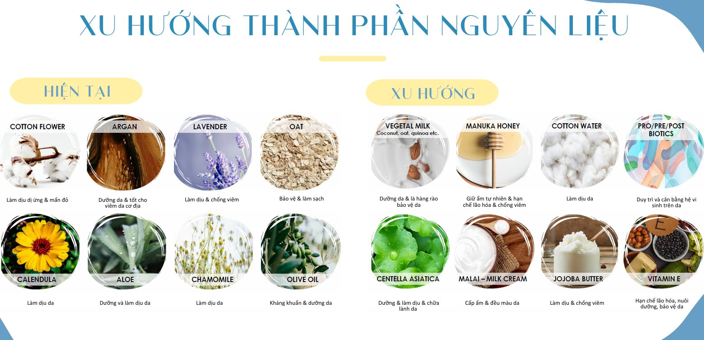
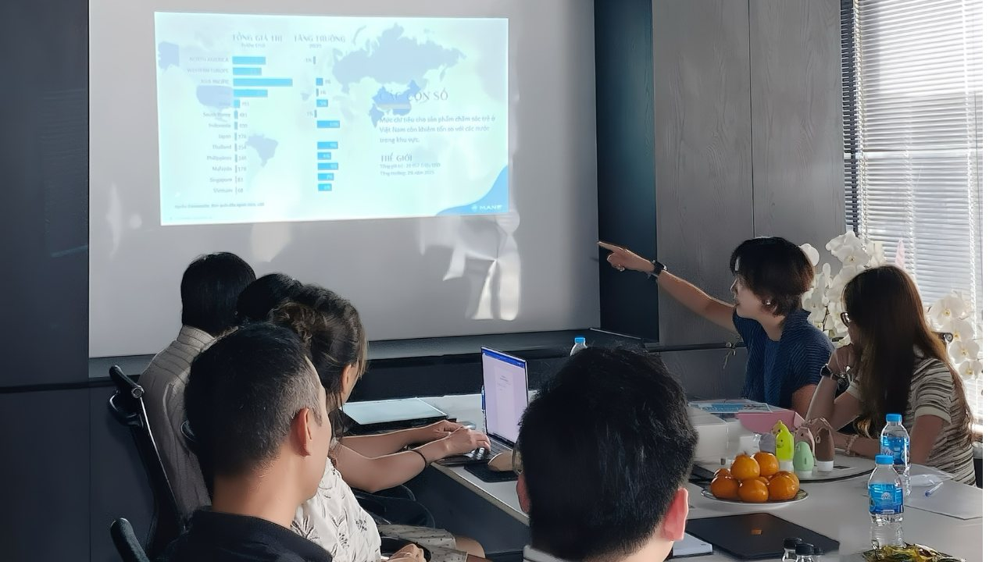

**Komlife Việt Nam hợp tác Tập đoàn Mane: Định hình bản sắc mùi hương Việt**

Trong những năm gần đây, **mùi hương** đã vượt ra khỏi vai trò phụ trợ, trở thành một **xu hướng trọng tâm** trong ngành hóa mỹ phẩm. Người tiêu dùng không chỉ tìm kiếm sản phẩm làm sạch hay bảo vệ, mà còn mong muốn trải nghiệm cảm xúc – một dấu ấn riêng biệt in sâu trong trí nhớ. Chính vì vậy, bất kỳ thương hiệu nào muốn khẳng định vị thế đều phải sở hữu một **“DNA”** đặc trưng, vừa là bản sắc, vừa là lợi thế cạnh tranh.

**Hợp tác chiến lược: Từ tham vọng sản phẩm đến chuẩn trải nghiệm**

Từ xu hướng phát triển của thị trường ngành việc **Komlife Việt Nam hợp tác cùng Tập đoàn Mane** – đơn vị có hơn **150 năm kinh nghiệm trong ngành phát triển hương** và nằm trong top những nhà sáng tạo hương hàng đầu thế giới – mang ý nghĩa vượt xa một thỏa thuận thương mại. Điều trăn trở của cả hai chính là tìm ra được “DNA” sản phẩm. Vì vậy trong buổi trao đổi vào ngày 16/9/2025 đã mở ra tầm nhìn mới trong ngành. Đây là bước đi chiến lược nhằm **định hình bản sắc mùi hương Việt**, mở ra hướng phát triển dài hạn cho thị trường hóa mỹ phẩm trong nước.

***Komlife Việt Nam hợp tác lâu dài với Tập đoàn Mane***

**Thỏa thuận hợp tác giữa Komlife và Mane tập trung vào ba trụ cột:**

1. **Đồng phát triển mùi hương** cho các dòng sản phẩm chủ lực của Komlife, ưu tiên đặc tính **lưu hương sâu**, **khả năng khử mùi** trong điều kiện độ ẩm cao, **độ an toàn** tiếp xúc hằng ngày với da và vải.
2. **Chuyển giao và đồng bộ hóa quy chuẩn R&D**, giúp Komlife rút ngắn thời gian từ ý tưởng đến sản phẩm thương mại (time-to-market) mà vẫn đảm bảo tiêu chuẩn quốc tế về chất lượng và truy xuất nguồn gốc.
3. **Định hình bản sắc hương Việt** thông qua những “nốt hương câu chuyện” gắn với ký ức khứu giác quen thuộc (vườn nhiệt đới sau mưa, hoa cỏ phố xá, thảo mộc nhà bếp Việt…), nhưng được tái cấu trúc theo gu thẩm mỹ hiện đại, tinh giản.

***Đại diện hợp tác Tập đoàn Mane***

Sự bổ trợ này giúp Komlife tăng tốc đổi mới, đồng thời mở đường để mùi hương không chỉ “thơm” mà còn “có câu chuyện, có cá tính” – yếu tố then chốt để sản phẩm bứt phá trong một thị trường cạnh tranh cao.

**Thị trường ngành: Từ con số đến cơ hội**

Các số liệu toàn cầu cho thấy bức tranh đa chiều:

***Tổng giá trị & tăng trưởng thị trường chăm sóc trẻ em toàn cầu***

- **Trung Quốc** chiếm 32% số sản phẩm công bố trong phân khúc chăm sóc cá nhân cho trẻ em. Tuy nhiên, tăng trưởng đang chững lại do già hóa dân số và tỷ lệ sinh giảm.
- **Hàn Quốc (11%), Ấn Độ (8%), Nhật Bản (8%)** là những thị trường năng động, liên tục tung ra sản phẩm mới và gắn thương hiệu với trải nghiệm hương.
- **Châu Á – Thái Bình Dương** đạt tổng giá trị 7.596 triệu USD, tăng trưởng trung bình 3%/năm. Trong đó, Indonesia (+10%), Thái Lan (+9%) và Philippines (+6%) là những điểm sáng nổi bật.

Tại **Việt Nam**, mức chi tiêu mới chỉ đạt khoảng **68 triệu USD**, một con số khiêm tốn so với quy mô khu vực. Tuy nhiên, chính khoảng trống này lại là cơ hội để thương hiệu trong nước tạo sự khác biệt. Với gần 100 triệu dân, tỷ lệ dân số trẻ cao và tốc độ đô thị hóa nhanh, Việt Nam hội tụ đủ điều kiện để bứt tốc nếu có chiến lược phù hợp.

Thị trường trong nước cũng đang bước vào giai đoạn chuyển dịch: người tiêu dùng ngày càng ưu tiên yếu tố trải nghiệm bên cạnh giá cả. Đây là thời điểm thuận lợi để các sản phẩm khác biệt về mùi hương tạo dấu ấn rõ rệt.

**Xu hướng mùi hương và tầm nhìn dài hạn**

Các chuyên gia Mane đã chỉ ra hai xu hướng nổi bật trong phát triển hương liệu:

***Xu hướng thành phần nguyên liệu ngành hóa mỹ phẩm***

- **An toàn – dịu nhẹ**, đặc biệt với phân khúc mẹ và bé 0–3 tuổi. Trẻ nhỏ có thể khóc không chỉ vì đói, mà còn bởi nhạy cảm khứu giác hoặc căng thẳng môi trường. Vì vậy, mùi hương trong sản phẩm cho trẻ cần được kiểm soát nồng độ, vừa đủ để tạo cảm giác dễ chịu và làm dịu.
- **Nguyên liệu thiên nhiên kết hợp khoa học hiện đại**: từ sữa thực vật, mật ong Manuka, biotics đến Centella Asiatica, Vitamin E, jojoba butter. Các thành phần này vừa mang tính dưỡng, vừa bảo vệ, đáp ứng nhu cầu “an toàn – hiệu quả – bền vững” của người tiêu dùng hiện nay.

Trong tầm nhìn dài hạn, Komlife Việt Nam và Mane cùng theo đuổi triết lý **“mùi hương kể chuyện”**. Thay vì tạo ra những hương thơm phổ thông, mỗi sản phẩm sẽ mang một cá tính riêng:

- **Hương hoa sang trọng**: gợi sự quý phái, đẳng cấp.
- **Hương hoa hiện đại tinh tế**: thanh lịch, trẻ trung, hợp gu thẩm mỹ thành thị.
- **Thảo mộc bản địa**: gần gũi, an tâm, gợi nhớ ký ức Việt.

Song song, Komlife Việt Nam hướng tới xây dựng một **hệ sinh thái mùi hương đồng bộ**. Khi nước giặt, nước xả, xịt vải, lau sàn có thể phối lớp hài hòa, người dùng sẽ được trải nghiệm một không gian hương thống nhất, tinh tế trong chính ngôi nhà của mình.

**Thị trường ngách: Chìa khóa khác biệt**

Để cạnh tranh trước các thương hiệu quốc tế, việc tập trung vào thị trường ngách được xem là chiến lược khả thi. Với Komlife Việt Nam, những ngách tiềm năng gồm:

- **Ngách thảo mộc Việt**: bồ kết, sài đất, hương nhu – vốn gắn liền với đời sống người Việt. Khi được ứng dụng trong công thức hiện đại, đây sẽ là lợi thế khác biệt.
- **Ngách bệnh viện và chăm sóc đặc thù**: sản phẩm khử khuẩn dịu nhẹ, phục vụ nhu cầu an toàn trong môi trường nhạy cảm.
- **Ngách gia đình trẻ đô thị**: nhóm khách hàng sẵn sàng chi trả cho sản phẩm vừa an toàn cho trẻ, vừa mang lại trải nghiệm tinh tế cho cha mẹ.

***Buổi trao đổi về phân tích thị trường và những định hướng phát triển mới***

Chiến lược tập trung vào ngách cũng cho phép thương hiệu định vị rõ ràng hơn trong trưng bày, phân phối và truyền thông, từ đó tối ưu hiệu quả và sử dụng ngân sách hợp lý.

**Komlife Việt Nam: Từ sản phẩm đến chuẩn trải nghiệm**

Sự hợp tác giữa Komlife Việt Nam và Tập đoàn Mane không chỉ mang công nghệ hương toàn cầu vào thị trường nội địa, mà còn mở ra một chuẩn mực mới cho ngành hóa mỹ phẩm Việt – nơi mùi hương trở thành trung tâm trải nghiệm. Trong xu hướng FMCG hiện nay, thị trường đang chuyển từ **sản phẩm chức năng** sang **trải nghiệm thương hiệu toàn diện**. Người tiêu dùng mong chờ nhiều hơn ở một sản phẩm: sự an tâm, thư thái và dấu ấn riêng.

Từ đó, Komlife Việt Nam đặt ra tham vọng: đi từ sản phẩm đến chuẩn trải nghiệm – biến mỗi sản phẩm chăm sóc gia đình không chỉ là một lựa chọn tiêu dùng, mà là một điểm chạm cảm xúc, góp phần định hình bản sắc mùi hương Việt trên bản đồ khu vực.
