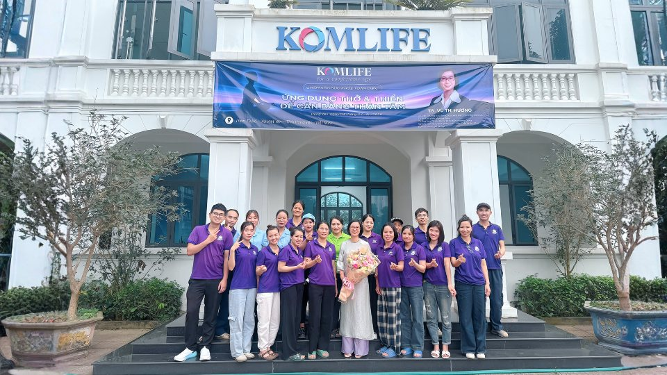
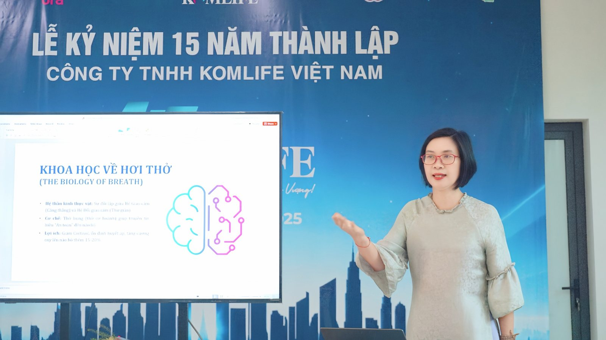
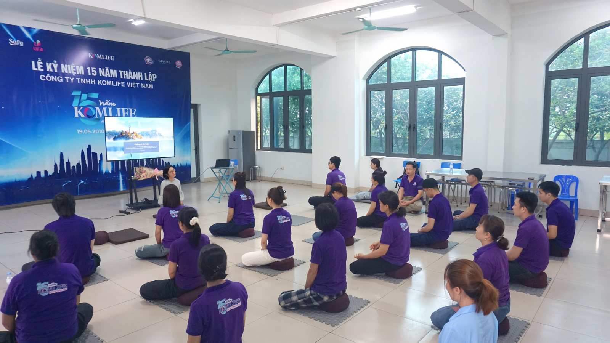
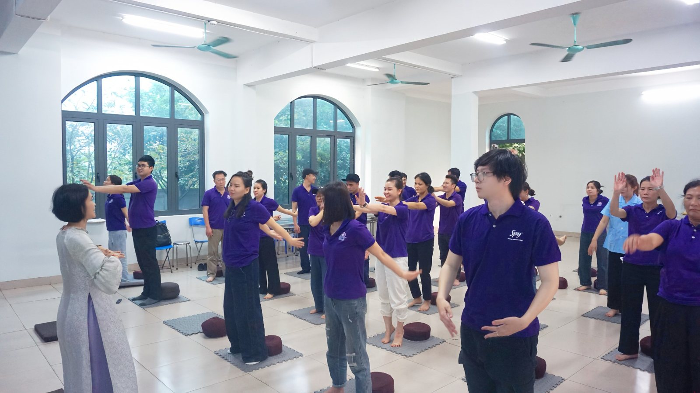
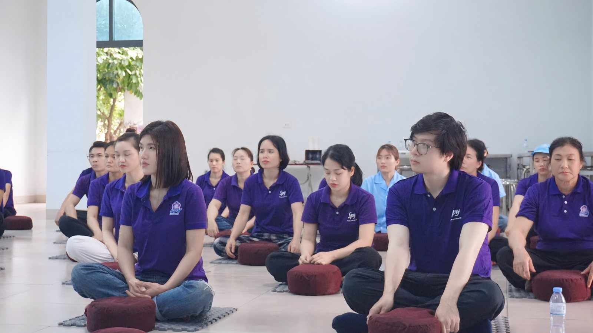

Tại KomLife Việt Nam, chúng tôi luôn coi con người là tài sản quý giá nhất, bởi một hệ thống vận hành mạnh mẽ không chỉ dựa trên máy móc hiện đại mà còn bắt nguồn từ năng lượng tích cực của đội ngũ nhân sự. Với mục tiêu xây dựng môi trường làm việc hạnh phúc, vừa qua, chương trình đào tạo "Chăm sóc sức khỏe toàn diện: Ứng dụng Thở & Thiền để cân bằng Thân Tâm" đã được tổ chức thành công. Đây là hoạt động trọng điểm trong chiến lược nâng cao đời sống tinh thần, giúp mỗi cán bộ công nhân viên (CBCNV) tiếp cận các phương pháp khoa học để tự điều chỉnh trạng thái tâm lý trước những áp lực công việc thường nhật.

**Trao đổi trực tiếp cùng chuyên gia**

Chương trình vinh dự có sự dẫn dắt của Tiến sĩ Vũ Thị Hương – chuyên gia từ Đại học Quốc gia Hà Nội, người đã mang đến cái nhìn sâu sắc về cơ chế sinh học của hơi thở. Thay vì những lý thuyết trừu tượng, nội dung đào tạo tập trung vào việc giúp CBCNV hiểu rõ cách thức hệ thần kinh phản ứng với căng thẳng. Qua đó, diễn giả đã hướng dẫn các phương pháp sử dụng hơi thở như một công cụ điều tiết để lấy lại trạng thái cân bằng nhanh chóng. Những kiến thức thực tiễn này giúp mỗi cá nhân chủ động hơn trong việc bảo vệ sức khỏe nội tại giữa nhịp độ công việc hối hả.

**Trải nghiệm thực tế và gắn kết tập thể**

Tiếp nối phần lý thuyết, phần lớn thời lượng được dành cho việc trải nghiệm trực tiếp các kỹ thuật thở và bài tập tĩnh tâm. Trong sắc áo đồng phục Spy, toàn thể nhân viên đã cùng thực hiện các động tác điều thân, tạo nên một hình ảnh đồng bộ và gắn kết mạnh mẽ. Hoạt động này không chỉ giúp giải tỏa căng thẳng cơ bắp hay mệt mỏi thể chất, mà còn là nhịp cầu để các phòng ban xích lại gần nhau hơn. Khoảng thời gian nghỉ giải lao với điểm tâm nhẹ đã biến buổi học thành một không gian giao lưu cởi mở, nơi tinh thần đồng nghiệp được thắt chặt qua những chia sẻ chân thành.

**Không khí tươi vui và những thử thách hấp dẫn trong buổi gặp mặt**

Bên cạnh những giây phút tĩnh lặng, không khí hội trường  dần trở lên vui vẻ và hào hứng hơn với  trò chơi, thử thách đến từ ban tổ chức. Thay vì những bài kiểm tra y tế khô khan, mỗi thành viên Komlife Việt Nam đã tự mình kiểm tra sức khỏe của hơi thở thông qua việc nín thở và đếm số theo nhị[p.](http://p.th) Hoạt động trải nghiệm này đã ghi nhận những kết quả thực tế về sự khác biệt rõ rệt trong chỉ số sức khỏe hệ hô hấp cũng như khả năng làm chủ hơi thở giữa các cá nhân trong tập thể. Chính những tình huống đối lập thực tế đó đã tạo nên một không khí vô cùng vui vẻ và hào hứng, giúp toàn thể cán bộ công nhân viên không chỉ có những giây phút giải trí sảng khoái mà còn tự nhận thức được tầm quan trọng của việc rèn luyện sức khỏe phổi mỗi ngày.

**Komlife Việt Nam: Đặt sức khỏe toàn diện của nhân sự làm tiền đề phát triển bền vững.**

Khép lại buổi thực hành trong không khí thư thái và đầy ắp tiếng cười, Ban Giám đốc KomLife Việt Nam một lần nữa khẳng định rõ nét định hướng nhân văn trong văn hóa doanh nghiệp: lấy con người làm trung tâm và ưu tiên sự cân bằng Thân – Tâm của mỗi nhân viên. Chính những phản hồi tích cực và nguồn năng lượng mới từ đội ngũ cán bộ công nhân viên sau sự kiện là minh chứng sống động nhất, trở thành cơ sở vững chắc để công ty tiếp tục duy trì và nhân rộng những hoạt động ý nghĩa này trong tương lai.

Thành công của chương trình không chỉ dừng lại ở những kỹ thuật chăm sóc sức khỏe đã được trao đi, mà còn là một bước chuẩn bị chiến lược để mỗi thành viên KomLife luôn giữ vững phong độ và sự minh mẫn. Đó không chỉ là lời cam kết đồng hành, mà còn là động lực để tập thể cùng nhau bứt phá, sẵn sàng đưa thương hiệu vươn xa và hiện thực hóa những mục tiêu bùng nổ đã đề ra cho năm 2026.

