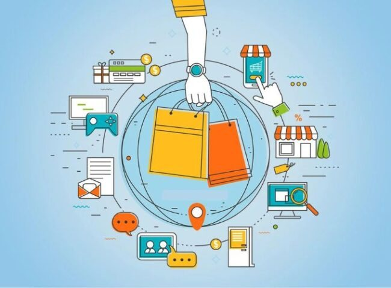
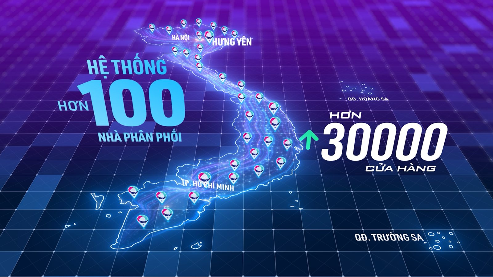
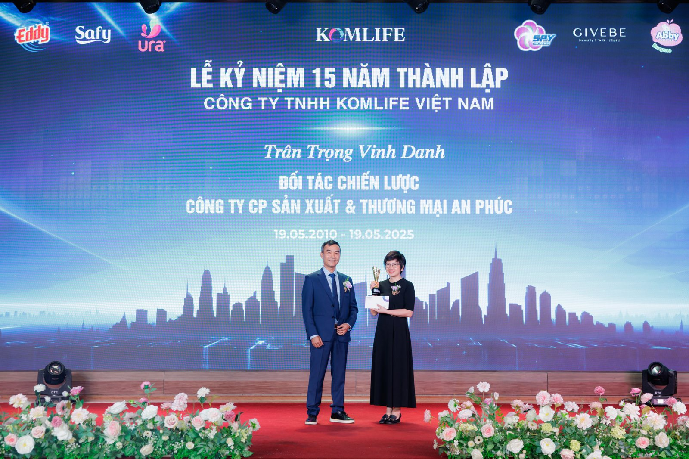

### Ngay từ khi thành lập, Komlife Việt Nam đã xác định chiến lược phân phối là một trong những trụ cột phát triển bền vững của doanh nghiệp. Chúng tôi không đơn thuần dừng lại ở việc đưa sản phẩm lên kệ – mà xây dựng một hệ sinh thái phân phối đa kênh, phủ khắp và linh hoạt.

### **Phân phối đa kênh (Omni-channel)**

Komlife triển khai đồng thời các kênh phân phối:

- Kênh truyền thống: Đại lý, nhà phân phối cấp 1, tiệm tạp hóa, cửa hàng tiện lợi trên toàn quốc.
- Kênh hiện đại: Siêu thị, chuỗi cửa hàng.
- Kênh online: Gian hàng chính hãng trên các sàn TMĐT (Shopee, Lazada, Tiki…), website, mạng xã hội.

Việc phối hợp nhịp nhàng giữa các kênh giúp Komlife Việt Nam luôn hiện diện ở nơi khách hàng cần – dù là ở nông thôn hay thành thị, online hay offline.

### **Phủ sóng thị trường theo vùng – cụm hiệu quả**

Komlife không dàn trải mà lựa chọn chiến lược "đánh cụm" – tập trung từng khu vực để xây dựng hệ thống phân phối bài bản:

- Hợp tác chiến lược với nhà phân phối khu vực
- Hỗ trợ marketing – bán hàng tại chỗ cho đại lý
- Chính sách giá, thưởng, chiết khấu phù hợp từng vùng

Cách làm này giúp kiểm soát chất lượng dịch vụ, tăng độ nhận diện và tối ưu chi phí logistics.

### **Hợp tác win-win với đối tác phân phối**

Komlife Việt Nam xây dựng mối quan hệ dài hạn – cùng phát triển với đối tác,nhà phân phối và đại lý:

- Chính sách chiết khấu rõ ràng, ổn định
- Hỗ trợ POSM, quảng bá khu vực
- Đào tạo sản phẩm – chăm sóc khách hàng định kỳ

Chúng tôi tin rằng: chỉ khi đối tác bán hàng thành công, Komlife Việt Nam mới thật sự bền vững.

### **Phân phối hiệu quả là cầu nối giữa sản phẩm tốt và người tiêu dùng**

Với Komlife Việt Nam, phân phối không đơn thuần là đưa sản phẩm ra thị trường, mà là xây dựng một mạng lưới tin cậy, chuyên nghiệp, và hiệu quả để lan tỏa giá trị thương hiệu đến mọi miền đất nước.

**“Komlife Việt Nam – Vì một cuộc sống tốt đẹp hơn.”**
