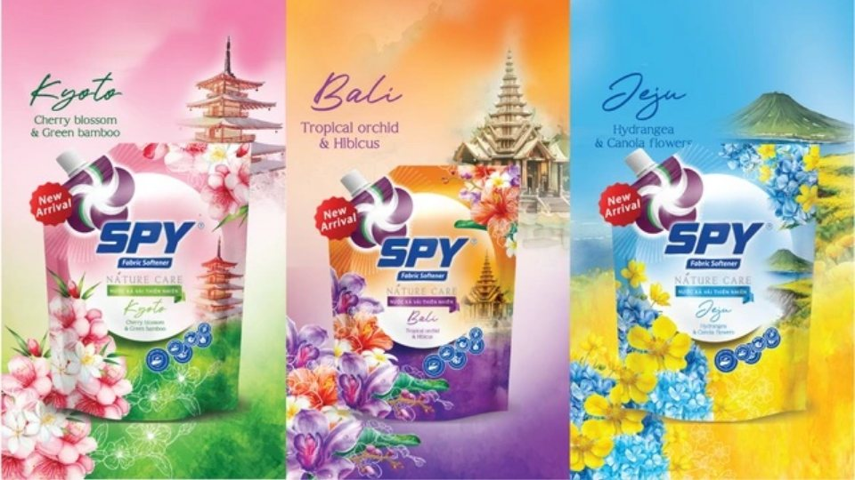
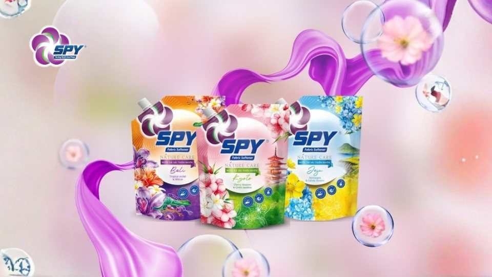

**(Trích bài viết từ báo Thanh niên)**

## Với nguồn cảm hứng từ thiên nhiên tươi đẹp của Hàn Quốc, Nhật Bản và Bali, SPY đã khéo léo đưa trọn hương tinh túy vào SPY Nature Care với hành trình khám phá đầy thú vị.

Trong xu hướng tiêu dùng ngày càng chú trọng đến các sản phẩm thân thiện với môi trường và mang đến trải nghiệm cảm xúc. SPY Nature Care - một làn gió mới thổi vào thế giới nước xả vải, mang đến cho bạn trải nghiệm giặt giũ hoàn toàn khác biệt. Với cảm hứng từ những thiên nhiên tươi đẹp của Hàn Quốc, Nhật Bản và Bali, SPY Nature Care hứa hẹn sẽ đưa bạn vào một hành trình khám phá hương thơm độc đáo, thư thái và gần gũi với thiên nhiên.

## **Hành trình khám phá thiên nhiên qua mùi hương**

SPY Nature Care là sự kết hợp hoàn hảo giữa công nghệ hiện đại và tinh túy từ thiên nhiên. Sản phẩm được chiết xuất từ các thành phần tự nhiên, an toàn cho da và thân thiện với môi trường. Đặc biệt, bộ sưu tập ba hương thơm độc đáo lấy cảm hứng từ ba đất nước nổi tiếng với vẻ đẹp thiên nhiên sẽ đưa bạn vào một hành trình khám phá đầy thú vị:

- Kyoto (Nhật Bản): Sự hòa quyện tinh tế giữa hương tre xanh mát và hoa anh đào ngọt ngào tạo nên một không gian thanh bình, thư thái, gợi nhớ đến những khu vườn Zen cổ kính.
- Jeju (Hàn Quốc): Mùi hương Jeju mang đến cảm giác tươi mát, trong lành với sự kết hợp hài hòa giữa hoa cẩm tú cầu và hoa cải dầu, như một làn gió biển dịu nhẹ thổi qua những cánh đồng hoa.
- Bali (Indonesia): Hương thơm Bali quyến rũ và ấm áp với sự kết hợp giữa hoa phong lan tím và hoa dâm bụt, đưa bạn đến những bãi biển cát trắng và những khu rừng nhiệt đới xanh mát.

## **Trải nghiệm mềm mại và thơm lâu**

Bên cạnh hương thơm đặc trưng, SPY Nature Care còn mang đến cho quần áo của bạn sự mềm mại trong từng sợi vải. Công thức đặc biệt giúp bảo vệ sợi vải, giảm thiểu tình trạng xù lông và giữ cho quần áo luôn mới. Hương thơm lưu lại trên quần áo suốt cả ngày, giúp bạn tự tin và thoải mái hơn.

## **Cam kết vì một cuộc sống xanh**

SPY luôn hướng đến mục tiêu phát triển bền vững. Sản phẩm SPY Nature Care được sản xuất trên dây chuyền công nghệ hiện đại, đảm bảo chất lượng và thân thiện với môi trường. An toàn dịu nhẹ và không kích ứng đối với làn da nhạy cảm.

Với SPY Nature Care, bạn không chỉ đang giặt giũ quần áo mà còn đang tận hưởng một hành trình khám phá thiên nhiên đầy thú vị. Mỗi lần sử dụng sản phẩm như được chạm đến thiên nhiên qua từng giọt hương, mang đến những cảm xúc mới lạ và thư giãn.

**Trích từ bài viết “**[Nước xả vải SPY Nature Care - Nhẹ nhàng dệt làn hương](https://thanhnien.vn/nuoc-xa-vai-spy-nature-care-nhe-nhang-det-lan-huong-185250123165628584.htm)**”, Báo Thanh niên, ngày 23/01/2025.**
