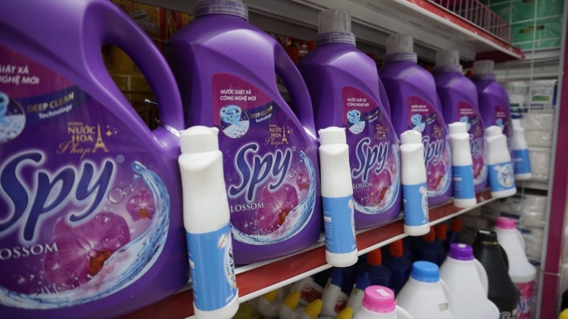

**(Trích bài viết từ báo VNExpress)**

Sau gần 10 năm có mặt trên thị trường, sản phẩm nước giặt Spy thu hút khách hàng bởi chất lượng và hương thơm quyến rũ.

Spy là thương hiệu 100% vốn Việt Nam, sản xuất bởi nhà máy hóa mỹ phẩm Komlife đặt tại tỉnh Hưng Yên. Có mặt trên thị trường gần 10 năm nhưng thương hiệu nước giặt xả Spy rất hiếm khi xuất hiện trên các quảng cáo truyền hình, báo chí. Spy kiên trì theo đuổi chiến lược "mưa dầm thấm lâu", dùng chất lượng sản phẩm và dịch vụ để từng bước thuyết phục khách hàng.

Giai đoạn những năm 2013, khi các nhà sản xuất còn chưa chú trọng đến hương thơm của bột giặt, nước giặt, phần lớn chỉ tập trung vào tính năng tẩy trắng, thương hiệu Spy đã cho ra mắt dòng nước giặt xả hương nước hoa Pháp. Đây là một bước đột phá lớn, đặc biệt lại đến từ một doanh nghiệp sản xuất thuần Việt. Sản phẩm nước giặt xả Spy - hương nước hoa Pháp mau chóng được người tiêu dùng quan tâm và trải nghiệm.

Đến năm 2015, thương hiệu Spy tiếp tục ra mắt dòng nước giặt xả Spy Plus có tính năng diệt khuẩn, khử mùi hôi mốc trên áo quần. Sản phẩm nhanh chóng được các bà, chị em nội trợ săn lùng. Khi thời tiết miền Bắc bước vào mùa nồm và một mùa đông ít nắng, Spy Plus là giải pháp giúp áo quần giặt xong không bị hôi ẩm, đặc biệt phù hợp với các căn hộ chung cư, thường xuyên phải phơi đồ trong nhà. năng tương tự.

Sự thành công của thương hiệu Nước giặt xả Spy là minh chứng cho thấy một doanh nghiệp Việt với nguồn lực hạn chế vẫn có thể vươn lên chiếm lĩnh thị phần và cạnh tranh với các thương hiệu ngoại. Để làm được điều đó, trước tiên, nhà sản xuất phải thực sự tận tâm với sản phẩm, kiên trì thấu hiểu nhu cầu của người tiêu dùng Việt, không ngại đổi mới và ứng dụng thành phần công nghệ mới để chiếm lĩnh vị trí tiên phong trên thị trường.

Việc trú trọng xây dựng kênh phân phối sâu rộng, chặt chẽ và duy trì hợp tác bền vững với các nhà phân phối, đại lý cũng là bí quyết chính giúp các sản phẩm mang thương hiệu Spy dễ dàng tiếp cận khách hàng. Thương hiệu còn đáp ứng được mong muốn tiêu dùng và dịch vụ khách hàng tận tâm, tạo dựng được lòng tin với khách hàng.

**Trích từ bài viết “**[Quá trình phát triển của thương hiệu nước giặt Spy](https://vnexpress.net/qua-trinh-phat-trien-cua-thuong-hieu-nuoc-giat-spy-4472760.html)**”, Báo VNExpress****, ngày 10/06/2022.**
