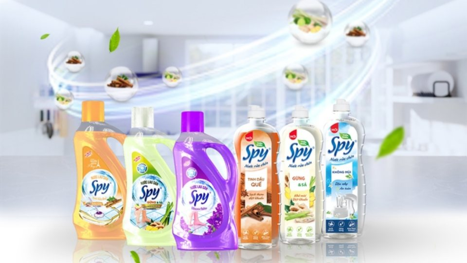

**(Trích bài viết từ báo Cafef)**

## Với nhịp sống hiện đại, con người ngày càng ý thức hơn về việc bảo vệ sức khỏe và môi trường. Theo nielsen, có đến 80% sẵn sàng chi trả nhiều tiền hơn cho các sản phẩm xanh và sạch.

Xu hướng sống xanh, hướng về thiên nhiên đang ngày càng được ưa chuộng. Điều này không chỉ thể hiện trong việc lựa chọn thực phẩm hữu cơ, trang trí nhà cửa bằng chất liệu tự nhiên mà còn lan tỏa đến cả việc sử dụng các sản phẩm làm sạch gia đình. Trong đó, nước rửa chén và nước lau sàn đóng vai trò quan trọng, góp phần tạo nên một không gian sống trong lành, an toàn cho cả gia đình.

**Vì sao sản phẩm thiên nhiên lại được ưa chuộng?**

Người tiêu dùng thông thái - hiện đại ngày càng quan tâm đến sản phẩm tốt cho sức khỏe và ít tác động đến môi trường. Các sản phẩm hóa học, dù có hiệu quả làm sạch cao, nhưng lại chứa nhiều chất tẩy rửa mạnh, gây hại cho da tay, ảnh hưởng đến đường hô hấp và gây ô nhiễm môi trường.

Do đó, xu hướng tìm kiếm các sản phẩm làm sạch có nguồn gốc từ thiên nhiên ngày càng trở nên phổ biến. Những sản phẩm này không chỉ đảm bảo hiệu quả làm sạch mà còn an toàn cho sức khỏe, thân thiện với môi trường.

**Nước rửa chén và nước lau sàn SPY - An toàn từ thiên nhiên cho nhịp sống hiện đại**

Thấu hiểu nhu cầu của người tiêu dùng, SPY - thương hiệu uy tín  đã cho ra đời dòng sản phẩm nước rửa chén và nước lau sàn chiết xuất từ thiên nhiên, mang đến giải pháp làm sạch hiệu quả, an toàn và thân thiện với môi trường.

Nước rửa chén và Nước lau sàn SPY thiên nhiên

Dòng sản phẩm Nước rửa chén và Nước lau sàn SPY được nhiều bà nội trợ đánh giá cao sau khi trải nghiệm sản phẩm. Lý do chính khiến chị em nội trợ yêu thích sản phẩm này là do tính chất an toàn của sản phẩm, với thành phần chính từ thảo mộc thiên nhiên như gửng, sả, quế  không chứa các chất hóa học độc hại, đảm bảo an toàn cho sức khỏe người sử dụng, đặc biệt là trẻ nhỏ và người có làn da nhạy cảm.

Dù được chiết xuất từ thiên nhiên nhưng sản phẩm SPY vẫn đảm bảo khả năng làm sạch mạnh mẽ, loại bỏ mọi vết bẩn cứng đầu trên chén bát, sàn nhà mà không làm trầy xước bề mặt. Hương thơm dịu nhẹ, thanh mát từ các loại thảo mộc tự nhiên không chỉ mang đến cảm giác thư thái mà còn giúp khử mùi hôi khó chịu, mang đến không gian sống trong lành.

**SPY - Sự kết hợp hoàn hảo giữa thiên nhiên và hiện đại**

Trong cuộc sống hiện đại, chúng ta luôn bận rộn với công việc và các mối quan hệ xã hội. Tuy nhiên, việc chăm sóc gia đình vẫn là ưu tiên hàng đầu. SPY hiểu điều đó và mang đến những sản phẩm giúp bạn tiết kiệm thời gian, công sức mà vẫn đảm bảo không gian sống luôn sạch sẽ, an toàn và gần gũi với thiên nhiên.

Lựa chọn sống xanh bảo vệ sức khỏe gia đình

SPY cung cấp nhiều loại sản phẩm nước rửa chén và nước lau sàn với các hương thơm khác nhau, đáp ứng nhu cầu của từng khách hàng.Để làm được điều này, Thương hiệu SPY đã đầu tư thời gian và đội ngũ R&D nghiên cứu để tìm ra công thức phù hợp, đáp ứng nhu cầu của người dùng và mang lại sản phẩm chất lượng.

Việc lựa chọn các sản phẩm làm sạch có nguồn gốc từ thiên nhiên như nước rửa chén và nước lau sàn SPY không chỉ là xu hướng mà còn là một hành động thiết thực để bảo vệ sức khỏe của bản thân và gia đình, góp phần xây dựng một môi trường sống xanh, sạch đẹp.

Người tiêu dùng có thể tìm mua sản phẩm tại các cửa hàng tạp hóa, hệ thống siêu thị trên toàn quốc hoặc chọn mua từ các kênh phân phối trực tuyến.

**Trích từ bài viết “**[Sản phẩm thiên nhiên - Xu hướng tiêu dùng hiện đại](https://cafef.vn/san-pham-thien-nhien-xu-huong-tieu-dung-hien-dai-18825012315121214.chn)**”, Báo Cafef, ngày 23/01/2025.**
