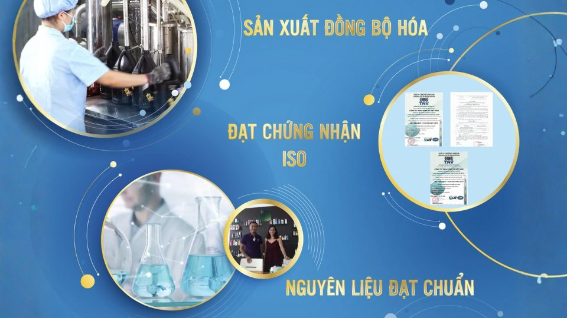
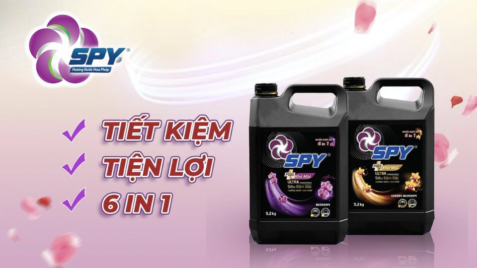

**(Trích bài viết từ báo Dân trí)**

Một sản phẩm giặt giũ chất lượng không chỉ giúp quần áo sạch bóng, thơm ngát mà còn mang đến cảm giác thoải mái, tự tin. Đó chính là lý do vì sao nước giặt xả SPY luôn được đông đảo người tiêu dùng đón nhận.

**SPY - Sự lựa chọn cho nhiều gia đình**

Việc giặt giũ trong gia đình cũng là một trong những công đoạn tiêu tốn khá nhiều thời gian. Vì vậy, các bà nội trợ ngày nay luôn tìm kiếm những sản phẩm góp phần tiết kiệm thời gian và các bước giặt, xả mà vẫn đảm bảo mục tiêu làm sạch vết bẩn, giúp quần áo mềm mại và lưu giữ hương thơm bền lâu.

Đại diện thương hiệu nước giặt SPY khẳng định: "Với công thức cải tiến, nước giặt xả với công nghệ kết hợp 2 tính năng giặt sạch và xả nước tiết kiệm thời gian và chi phí chỉ trong một nắp giặt, nước giặt SPY hương nước hoa Pháp không chỉ loại bỏ các vết bẩn cứng đầu và vi khuẩn (theo kết quả kiểm nghiệm số 260320-3143 của Viện Pasteur TPHCM, thực hiện vào năm 2020) giúp quần áo sạch sáng mà còn giữ được sự mềm mại và hương thơm lâu dài. Thành phần dịu nhẹ, an toàn cho da".

Nước giặt xả SPY  - Sự lựa chọn cho mọi gia đình.

**SPY - Đáp ứng tiêu chuẩn quốc tế**

Theo đại diện của thương hiệu nước giặt SPY, sản phẩm của thương hiệu SPY được sản xuất từ nhà máy Komlife Việt Nam đạt tiêu chuẩn ISO 9001:2015**-**Chứng nhận quốc tế về hệ thống quản lý chất lượng đạt chuẩn. Quy trình sản xuất đồng bộ hóa, sử dụng nguyên liệu nhập khẩu từ các quốc gia, đối tác có nền công nghiệp hóa chất phát triển và nổi tiếng về nguồn cung nguyên liệu, đảm bảo sản phẩm luôn ổn định và chất lượng khi tới tay người tiêu dùng.

Thương hiệu SPY chú trọng vào phát triển, cải tiến sản phẩm cung cấp đa dạng các dòng sản phẩm với nhiều hương thơm và công dụng khác nhau, đáp ứng nhu cầu của mọi khách hàng.

Quy trình sản xuất đạt chuẩn quốc tế.

**SPY - Đồng hành cùng người tiêu dùng Việt**

SPY luôn hướng đến việc mang đến sản phẩm chất lượng cao với giá cả phải chăng, phù hợp với khả năng tài chính của mọi gia đình để khách hàng nào cũng có thể trải nghiệm sản phẩm. Sản phẩm SPY  đã trở thành một phần trong cuộc sống hàng ngày của nhiều gia đình. Với hệ thống phân phối rộng khắp, khách hàng có thể dễ dàng tìm thấy các sản phẩm của thương hiệu SPY tại các siêu thị, cửa hàng tiện lợi trên toàn quốc.

Sản phẩm đồng hành cùng hàng triệu gia đình Việt.

Với những ưu điểm vượt trội, nước giặt xả SPY ngày càng được nhiều người tin dùng đón nhận.

**Trích từ bài viết “**[SPY - Thương hiệu nước giặt xả được nhiều người tiêu dùng đón nhận](https://dantri.com.vn/doi-song/spy-thuong-hieu-nuoc-giat-xa-duoc-nhieu-nguoi-tieu-dung-don-nhan-20250124100038907.htm)**”, Báo Dân trí, ngày 24/01/2025.**
