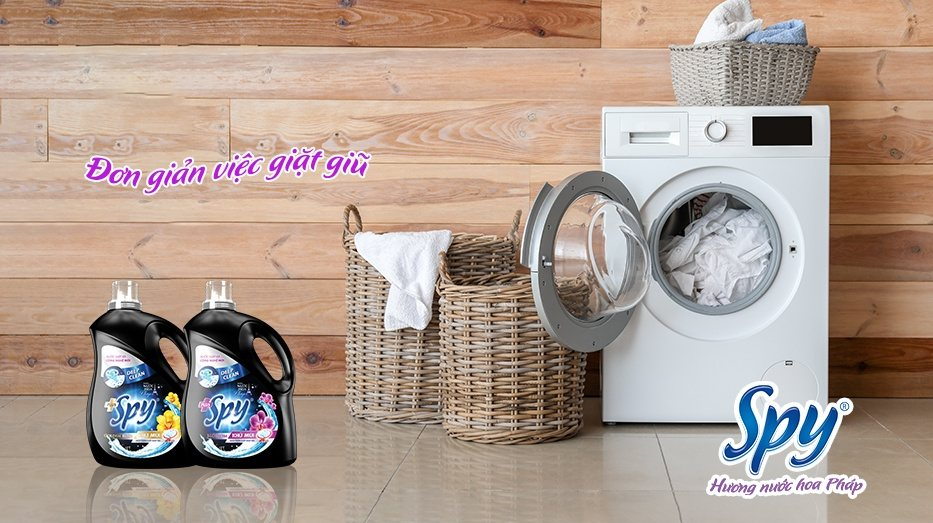
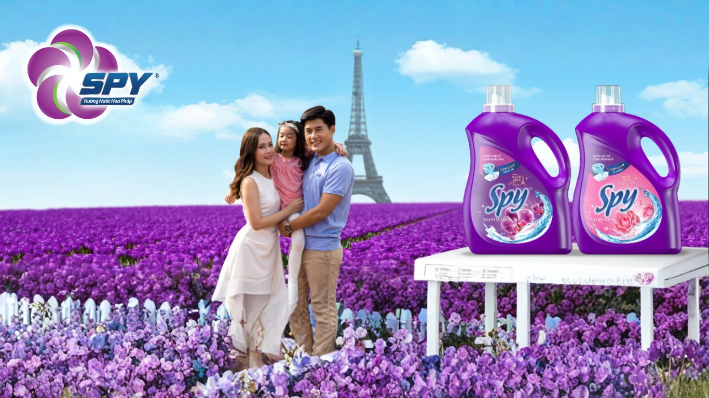
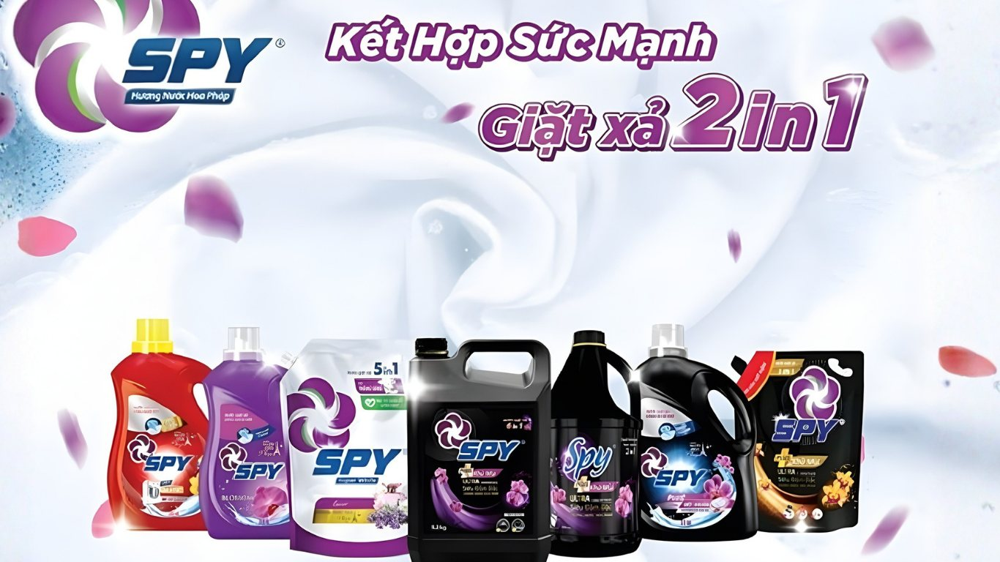
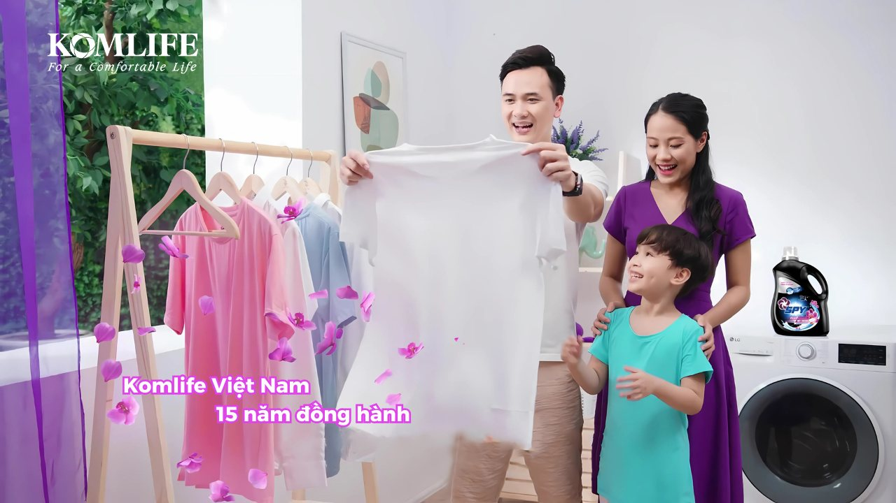

(Trích báo Gia đình & Xã hội)

Trong nhịp sống hiện đại hối hả, mỗi gia đình đều có những mối bận tâm riêng về công việc, trách nhiệm. Nhưng tình yêu và sự quan tâm dành cho những người thân yêu vẫn luôn được đặt lên hàng đầu. Đó chính là lý do [SPY Việt Nam](https://www.facebook.com/giatxaSpy), thương hiệu chăm sóc gia đình với hơn 15 năm kinh nghiệm - đã và đang trở thành người bạn đồng hành đáng tin cậy, mang đến những giải pháp toàn diện để chăm sóc gia đình và vun đắp cho hạnh phúc cho mọi nhà.

Khởi nguồn từ sự thấu hiểu sâu sắc những nhu cầu thiết yếu của người tiêu dùng, Thương hiệu SPY không ngừng nghiên cứu và phát triển mang đến một hệ sinh thái sản phẩm đa dạng, từ nước giặt, nước xả vải đến nước rửa chén, nước lau sàn và sữa rửa tay. Mỗi sản phẩm đều là kết tinh của sự kết hợp hoàn hảo giữa công nghệ tiên tiến và những tinh túy từ thiên nhiên, giúp việc chăm sóc nhà cửa không còn là gánh nặng mà trở thành một trải nghiệm thú vị, nhẹ nhàng.

**Giặt sạch lâu, lưu hương sang trọng - Bí quyết tự tin của mọi gia đình**

Quần áo không chỉ là trang phục mà còn là cách chúng ta thể hiện phong cách và cá tính. Một bộ quần áo sạch sẽ, thơm tho sẽ mang lại sự tự tin và nguồn năng lượng tích cực suốt cả ngày dài. Thấu hiểu điều đó, SPY đã đầu tư mạnh mẽ vào dòng sản phẩm giặt xả, đặc biệt là Nước giặt xả SPY hương nước hoa Pháp.

Với công nghệ đột phá, sản phẩm là kết hợp hai tính năng giặt sạch và xả thơm chỉ trong một nắp giặt, giúp các bà nội trợ tiết kiệm tối đa thời gian và chi phí. Công thức cải tiến giúp loại bỏ các vết bẩn cứng đầu và diệt khuẩn hiệu quả, đảm bảo quần áo luôn sạch sáng, an toàn cho cả gia đình.

Điểm nhấn làm nên sự khác biệt của SPY chính là hương nước hoa Pháp tinh tế, sang trọng. Khác với các sản phẩm thông thường, mỗi hương thơm của SPY được cấu thành từ nhiều tầng hương khác nhau, tạo nên cấu trúc hương độc đáo như một loại nước hoa cao cấp: từ nốt hương hoa cỏ nồng nàn, ngọt ngào của trái cây đến hương gỗ ấm áp. Nhờ vậy, hương thơm không chỉ lưu lại trên quần áo suốt cả ngày mà còn bám bền lâu đến cả tuần, giúp bạn luôn tự tin tỏa sáng.

SPY hiểu rằng mỗi gia đình có một nhu cầu giặt giũ khác nhau. Vì thế, thương hiệu mang đến nhiều dòng sản phẩm chuyên biệt:

- Dòng sản phẩm SPY Ultra Clean, Ultra Clean Plus hay Ultra Clean Matic sở hữu công thức đậm đặc, tiết kiệm chi phí, chỉ cần một nắp cho một chu trình giặt. Loại bỏ vết bẩn cứng đầu, giữ quần áo mềm mại, bền màu và lưu hương nước hoa Pháp dài lâu.
- Đối với SPY Deep Clean, Deep Clean Plus và Deep Clean Matic, dòng sản phẩm nước giặt diệt khuẩn với thành phần Tinosan HP100, bảo vệ sức khỏe cả gia đình, đặc biệt phù hợp với gia đình có trẻ nhỏ hoặc người có làn da nhạy cảm.
- SPY Nature Care là dòng nước xả vải chiết xuất từ thiên nhiên, lấy cảm hứng từ hương hoa và cảnh sắc xinh đẹp tại các vùng đất Kyoto, Jeju và Bali. Dịu nhẹ, an toàn với sức khỏe người tiêu dùng.
- Ngoài ra, SPY Super White có thành phần nguồn gốc thực vật cùng hoạt chất Tinopal giúp quần áo luôn trắng sáng như mới, bảo vệ sợi vải tối ưu.

**Sống “xanh” - An toàn từ thiên nhiên**

Xu hướng sống xanh đang ngày càng phổ biến. Người tiêu dùng hiện đại không chỉ quan tâm đến hiệu quả mà còn chú trọng đến sự an toàn cho sức khỏe và môi trường. Hiểu được tâm lý đó, SPY đã cho ra đời dòng sản phẩm nước rửa chén và nước lau sàn chiết xuất từ thiên nhiên.

Các sản phẩm đều được chiết xuất từ các loại thảo mộc tự nhiên như gừng, sả, quế không chứa các hóa chất độc hại, đảm bảo an toàn cho làn da, đặc biệt là da nhạy cảm của trẻ nhỏ và phụ nữ. Dù được chiết xuất từ nguyên liệu thiên nhiên nhưng các sản phẩm của SPY vẫn đảm bảo khả năng làm sạch vượt trội, loại bỏ mọi vết bẩn cứng đầu trên chén bát hay sàn nhà mà không gây trầy xước bề mặt.

Hương thơm dịu nhẹ, thanh mát từ thảo mộc tự nhiên không chỉ mang lại cảm giác thư thái mà còn giúp khử mùi hôi khó chịu, trả lại không gian sống trong lành, gần gũi với thiên nhiên. Việc lựa chọn các sản phẩm làm sạch từ thiên nhiên như SPY không chỉ là một xu hướng mà còn là một hành động thiết thực để bảo vệ sức khỏe cả gia đình và góp phần xây dựng một môi trường sống xanh, sạch đẹp.

**Cam kết chất lượng ổn định**

Với SPY, chất lượng sản phẩm không chỉ là lời nói mà là một cam kết bền vững. Các sản phẩm của SPY được sản xuất tại nhà máy Xanh Công ty TNHH Komlife Việt Nam đạt tiêu chuẩn quốc tế ISO 9001:2015; ISO 14001:2015 về hệ thống quản lý chất lượng và tiêu chuẩn Công nghiệp Nhật Bản JIS về sản phẩm. Toàn bộ quy trình sản xuất được đồng bộ hóa, sử dụng nguồn nguyên liệu nhập khẩu từ các đối tác uy tín trong và ngoài nước, đảm bảo mỗi sản phẩm khi đến tay người tiêu dùng đều đạt chất lượng tốt nhất.

Cùng với hệ thống phân phối rộng khắp trên toàn quốc, bạn có thể dễ dàng tìm thấy các sản phẩm của SPY tại các siêu thị, cửa hàng tiện lợi hoặc các trang thương mại điện tử. SPY tự hào đã trở thành một phần trong cuộc sống hàng ngày của hàng triệu gia đình, đồng hành cùng người tiêu dùng Việt Nam trên hành trình chăm sóc gia đình và xây dựng một cuộc sống hạnh phúc, trọn vẹn.

SPY Việt Nam không chỉ đơn thuần là một thương hiệu sản phẩm giặt xả, mà còn là một câu chuyện về tình yêu, sự quan tâm và trách nhiệm. Mỗi sản phẩm của SPY đều chứa đựng tâm huyết của đội ngũ nghiên cứu và sản xuất với mong muốn mang đến một cuộc sống tốt đẹp hơn cho mọi gia đình Việt.

**Bài viết trích từ "**[SPY Việt Nam - Chăm sóc vẹn toàn cho cuộc sống](https://giadinh.suckhoedoisong.vn/spy-viet-nam-cham-soc-ven-toan-cho-cuoc-song-viet-172250915100534824.htm)Việt" báo Gia đình & Xã hội, ngày 15/09/2025.
