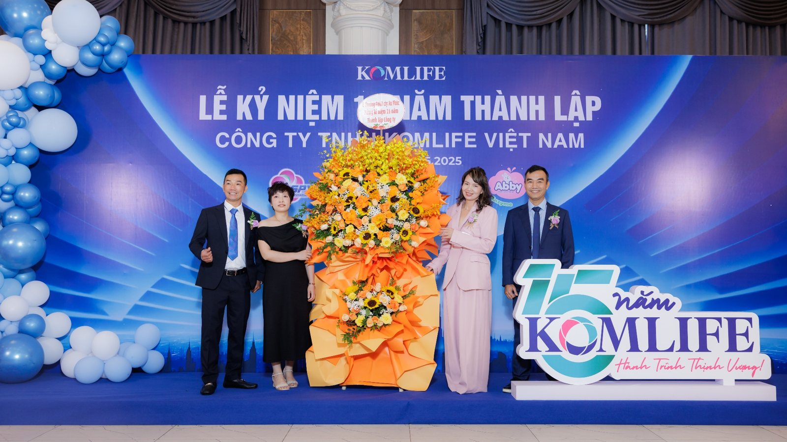
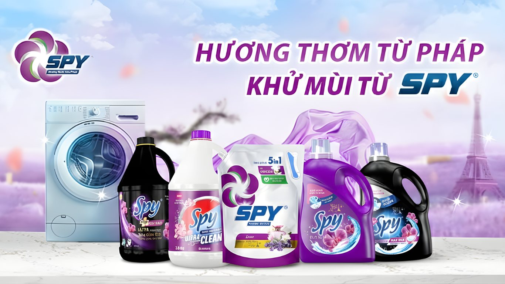

**(Trích bài viết từ báo Cafebiz)**

Trong suốt 15 năm đồng hành cùng hàng triệu gia đình Việt, SPY Việt Nam không chỉ đơn thuần mang đến những sản phẩm giặt giũ, mà còn tạo nên những trải nghiệm chăm sóc gia đình tiết kiệm - an toàn - hiệu quả.

Từ những sản phẩm nước giặt xả hương nước hoa Pháp sang trọng, đến nước giặt diệt khuẩn - khử mùi bảo vệ sức khỏe hay các sản phẩm làm sạch thiên nhiên dịu nhẹ, SPY đã và đang trở thành người bạn đồng hành tin cậy trong từng góc nhỏ của tổ ấm.

**Chất lượng khẳng định bằng tiêu chuẩn quốc tế**

SPY được sản xuất tại Nhà máy Xanh Công ty TNHH Komlife Việt Nam đạt tiêu chuẩn ISO 9001:2015; ISO 14001:2015 - Chứng nhận quốc tế về hệ thống quản lý chất lượng đạt chuẩn và tiêu chuẩn Công nghiệp Nhật Bản JIS. Quy trình sản xuất đồng bộ hóa, sử dụng nguyên liệu đạt chuẩn từ các đối tác trong và ngoài nước, đảm bảo mỗi sản phẩm khi đến tay người tiêu dùng đều đạt chất lượng ổn định và an toàn.

Không chỉ dừng ở việc đáp ứng tiêu chuẩn quốc tế, [SPY Việt Nam](https://www.facebook.com/giatxaSpy) còn đầu tư mạnh vào nghiên cứu và phát triển (R&D), liên tục cải tiến công thức để phù hợp với thị hiếu tiêu dùng Việt, đáp ứng đầy đủ nhất các nhu cầu của khách hàng.

**Đa dạng giải pháp - Đáp ứng mọi nhu cầu giặt giũ**

SPY hiểu rằng mỗi gia đình có một nhu cầu giặt giũ khác nhau. Vì thế, thương hiệu mang đến nhiều dòng sản phẩm chuyên biệt:

- Dòng sản phẩm SPY Ultra Clean, Ultra Clean Plus hay Ultra Clean Matic sở hữu công thức đậm đặc, tiết kiệm chi phí, chỉ cần một nắp cho một chu trình giặt. Loại bỏ vết bẩn cứng đầu, giữ quần áo mềm mại, bền màu và lưu hương nước hoa Pháp dài lâu.
- Đối với SPY Deep Clean, Deep Clean Plus và Deep Clean Matic, dòng sản phẩm nước giặt diệt khuẩn với thành phần Tinosan HP100, bảo vệ sức khỏe cả gia đình, đặc biệt phù hợp với gia đình có trẻ nhỏ hoặc người có làn da nhạy cảm.
- SPY Nature Care là dòng nước xả vải chiết xuất từ thiên nhiên, lấy cảm hứng từ hương hoa và cảnh sắc xinh đẹp tại các vùng đất Kyoto, Jeju và Bali. Dịu nhẹ, an toàn với sức khỏe người tiêu dùng.
- Ngoài ra, SPY Super White có thành phần nguồn gốc thực vật cùng hoạt chất Tinopal giúp quần áo luôn trắng sáng như mới, bảo vệ sợi vải.

Mỗi sản phẩm đều là sự kết hợp của hiệu quả làm sạch, chăm sóc sợi vải và trải nghiệm hương thơm, giúp công việc giặt giũ không còn là gánh nặng mà trở thành niềm vui mỗi khi chăm sóc gia đình.

**Hương thơm - “Ngôn ngữ” cảm xúc của SPY**

Nếu chất lượng là “trái tim” thì hương thơm chính là “tâm hồn” của các sản phẩm SPY. Mỗi dòng sản phẩm đều sở hữu tầng hương độc đáo được nghiên cứu kỹ lưỡng, từ nốt đầu tươi mát của hương hoa, nốt giữa ngọt ngào từ trái cây, đến nốt cuối sâu lắng của gỗ và thảo mộc - giống cấu trúc một chai nước hoa cao cấp.

Nhờ công nghệ hạt lưu hương, quần áo sau khi giặt vẫn tỏa hương dễ chịu suốt cả tuần. Mùi hương không chỉ giúp người mặc tự tin, mà còn khơi gợi cảm xúc và gắn kết các thành viên gia đình qua những khoảnh khắc quen thuộc: chiếc áo sơ mi thơm nhẹ mùi vải sạch của bố, chiếc váy mềm mại thoang thoảng hương hoa của mẹ, hay bộ đồng phục thơm mát của bé khi tới trường.

**An toàn cho sức khỏe - Thân thiện với môi trường**

Trong xu hướng tiêu dùng hiện đại, “sống xanh” không còn là lựa chọn mà là xu thế tất yếu. SPY chủ động đáp ứng điều này bằng việc không sử dụng chất tẩy độc hại gây kích ứng da. Sử dụng thành phần chiết xuất từ thiên nhiên cho các dòng sản phẩm như SPY Nature Care, SPY nước rửa chén thiên nhiên và SPY nước lau sàn thiên nhiên, các sản phẩm nước giặt xả thành phần an toàn. Nhờ vậy, SPY không chỉ làm sạch quần áo mà còn góp phần bảo vệ sức khỏe của người tiêu dùng và môi trường xung quanh.

**SPY - Người bạn đồng hành của mọi gia đình Việt**

Với mạng lưới phân phối rộng khắp, sản phẩm SPY hiện đã có mặt tại các hệ thống siêu thị lớn, cửa hàng tiện lợi, chợ truyền thống hay các sàn thương mại điện tử trên toàn quốc. Dù ở thành phố hay vùng nông thôn, người tiêu dùng đều có thể dễ dàng tiếp cận và trải nghiệm các sản phẩm của SPY.

Từ khi ra đời đến nay, SPY không chỉ tập trung vào kinh doanh, mà còn gắn bó với cộng đồng thông qua các hoạt động CSR (trách nhiệm xã hội) như ủng hộ đại dịch và Tết vì người nghèo.

Với tầm nhìn trở thành một trong những thương hiệu giặt giũ được yêu thích nhất Việt Nam, SPY vẫn đang tiếp tục đổi mới, không ngừng lắng nghe phản hồi từ khách hàng để tạo ra những sản phẩm ngày càng hoàn thiện hơn.

Giữa vô vàn lựa chọn trên thị trường, SPY vẫn giữ được chỗ đứng vững chắc nhờ chất lượng ổn định, sự thấu hiểu người tiêu dùng và cam kết với môi trường. Mỗi sản phẩm không chỉ là giải pháp giặt giũ mà còn là lời cam kết chăm sóc từng sợi vải một cách chu đáo nhất. Hòa chung không khí kỷ niệm Quốc khánh 2/9, SPY Việt Nam tự hào góp phần lan tỏa tinh thần dân tộc, mang đến những sản phẩm đạt chuẩn chất lượng, khẳng định bản lĩnh và dấu ấn Việt trên thị trường.

**Trích từ bài viết “[SPY Việt Nam - Hành trình 15 năm chăm sóc gia đình Việt với giải pháp giặt giũ toàn diện](https://cafebiz.vn/spy-viet-nam-hanh-trinh-15-nam-cham-soc-gia-dinh-viet-voi-giai-phap-giat-giu-toan-dien-176250915093517423.chn)****”, Báo Cafebiz, ngày 15/09/2025.**
