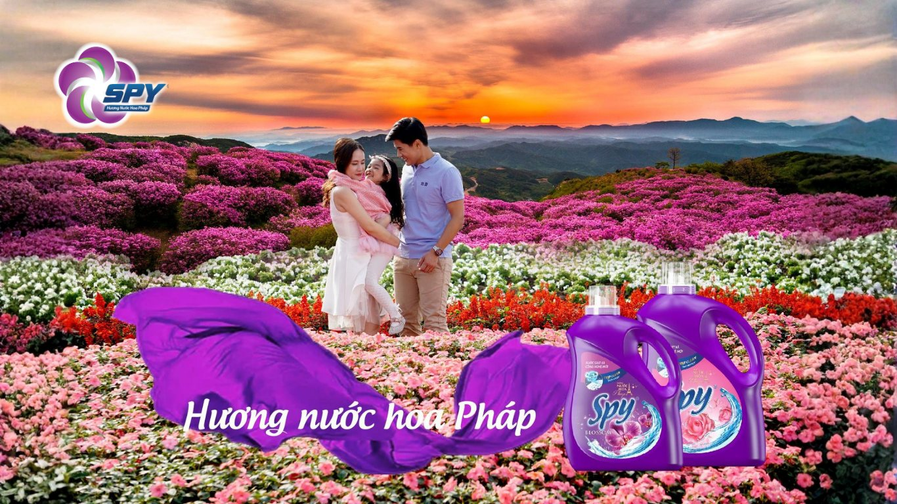
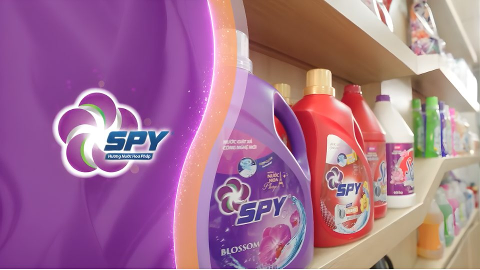

**(Trích báo Phụ nữ Việt Nam)**

Có những ký ức chẳng cần ảnh chụp hay dòng chữ để ghi nhớ, chỉ một làn hương thoảng qua cũng đủ khiến ta chợt mỉm cười, bồi hồi như vừa gặp lại. Với SPY Việt Nam, từng giọt hương không chỉ làm mềm mại quần áo hay mang lại cảm giác sạch thơm, mà còn được chăm chút để trở thành “người bạn đồng hành” lưu giữ ký ức.

SPY tin rằng: **mỗi mùi hương là một câu chuyện, mỗi nếp vải là một ký ức**, và khi hương thơm được giữ lại trọn vẹn, chính là khi chúng ta được sống lại những phút giây hạnh phúc một cách trọn vẹn nhất.

# **Dòng chảy ký ức mang tên hương thơm**

Mỗi người đều có một “bộ sưu tập hương thơm” riêng trong trí nhớ. Đó có thể là mùi áo mới mẹ giặt cho ngày khai giảng, mùi thơm dịu của khăn bông sau nắng hay hương nước hoa phảng phất trên chiếc váy trong buổi hẹn hò đầu tiên.

Hương thơm không chỉ tác động đến khứu giác mà còn lưu dấu trong tâm trí. Nó là “chất xúc tác” giúp những ký ức trở nên sống động hơn bao giờ hết. Chính điều đó đã trở thành nguồn cảm hứng để SPY Việt Nam tạo nên những sản phẩm nước giặt xả hương nước hoa Pháp - nơi hương thơm được chắt lọc tinh tế giúp vừa thơm lâu, vừa khơi gợi cảm xúc.

Hương thơm từ nước giặt xả SPY Việt Nam không chỉ thể hiện sự sạch sẽ mà còn là ngôn ngữ của cảm xúc và ký ức. Đó là tình yêu của mẹ trong bộ đồng phục trắng tinh, sự chăm sóc của vợ qua chiếc áo sơ mi phẳng phiu, hay dấu ấn riêng bạn để lại qua hương thơm của mình. Hơn thế, hương thơm còn mang đến sự tự tin, thoải mái và thư thái trong từng khoảnh khắc hằng ngày.

# **SPY Việt Nam - Giặt sạch sâu, lưu hương sang trọng**

Điều tạo nên dấu ấn khác biệt của SPY chính là hương nước hoa Pháp đầy tinh tế và sang trọng. Không giống những sản phẩm giặt xả thông thường, mỗi mùi hương của SPY được chắt lọc từ nhiều tầng hương riêng biệt: khởi đầu với sự nồng nàn của hương hoa, hòa quyện cùng vị ngọt dịu của trái cây và kết lại bằng chút ấm áp, sâu lắng từ hương gỗ. Nhờ vậy, hương thơm không chỉ theo bạn suốt cả ngày mà còn lưu giữ bền lâu đến cả tuần, để bạn luôn tự tin tỏa sáng trong mọi khoảnh khắc.

SPY hiểu rằng mỗi gia đình có một nhu cầu giặt giũ khác nhau. Vì thế, thương hiệu mang đến nhiều dòng sản phẩm chuyên biệt:

- Dòng sản phẩm SPY Ultra Clean, Ultra Clean Plus hay Ultra Clean Matic sở hữu công thức đậm đặc, tiết kiệm chi phí, chỉ cần một nắp cho một chu trình giặt. Loại bỏ vết bẩn cứng đầu, giữ quần áo mềm mại, bền màu và lưu hương nước hoa Pháp dài lâu.
- Đối với SPY Deep Clean, Deep Clean Plus và Deep Clean Matic, dòng sản phẩm nước giặt diệt khuẩn với thành phần Tinosan HP100, bảo vệ sức khỏe cả gia đình, đặc biệt phù hợp với gia đình có trẻ nhỏ hoặc người có làn da nhạy cảm.
- SPY Nature Care là dòng nước xả vải chiết xuất từ thiên nhiên, lấy cảm hứng từ hương hoa và cảnh sắc xinh đẹp tại các vùng đất Kyoto, Jeju và Bali. Dịu nhẹ, an toàn với sức khỏe người tiêu dùng.
- Ngoài ra, SPY Super White có thành phần nguồn gốc thực vật cùng hoạt chất Tinopal giúp quần áo luôn trắng sáng như mới, bảo vệ sợi vải tối ưu.

# **SPY Việt Nam - Đồng hành cùng ký ức Việt**

Hơn 15 năm có mặt tại Việt Nam, SPY đã và đang trở thành một phần trong cuộc sống của hàng triệu gia đình. Từ bữa cơm hàng ngày, dịp lễ quây quần, đến những buổi đoàn tụ ngày Tết, SPY luôn hiện diện trong từng nếp áo thơm góp phần lưu giữ ký ức trọn vẹn.

Các sản phẩm của SPY được sản xuất tại nhà máy Xanh Công ty TNHH Komlife Việt Nam đạt tiêu chuẩn quốc tế ISO 9001:2015; ISO 14001:2015 về hệ thống quản lý chất lượng và tiêu chuẩn Công nghiệp Nhật Bản JIS về sản phẩm. Toàn bộ quy trình sản xuất được đồng bộ hóa, sử dụng nguồn nguyên liệu nhập khẩu từ các đối tác uy tín trong và ngoài nước, đảm bảo mỗi sản phẩm khi đến tay người tiêu dùng đều đạt chất lượng tốt nhất.

Với hệ thống phân phối rộng khắp trên toàn quốc, các sản phẩm SPY luôn hiện diện gần gũi và dễ dàng tìm thấy tại siêu thị, cửa hàng tiện lợi hay trên các trang thương mại điện tử. SPY tự hào khi đã trở thành một phần quen thuộc trong nhịp sống hàng ngày của hàng triệu gia đình Việt, đồng hành cùng người tiêu dùng trong hành trình chăm sóc tổ ấm và vun đắp cuộc sống hạnh phúc, trọn vẹn.

Không chỉ dừng lại ở vai trò của một thương hiệu giặt xả, SPY còn là câu chuyện về tình yêu, sự quan tâm và trách nhiệm. Mỗi sản phẩm được tạo nên từ tâm huyết và nỗ lực không ngừng của đội ngũ nghiên cứu – sản xuất, với mong muốn mang đến cho mọi gia đình Việt một cuộc sống sạch sẽ, an toàn và tràn đầy yêu thương.

# **SPY Việt Nam - Hương thơm của hiện tại, ký ức cho tương lai**

Hương thơm không bao giờ chỉ là mùi hương. Đằng sau mỗi làn hương thoảng qua là cả một bầu trời ký ức được đánh thức. Hương thơm chính là nhịp cầu vô hình kết nối cảm xúc, là cánh cửa đưa ra trở về với những khoảnh khắc đẹp đẽ tưởng chừng đã xa vời. Với SPY, từng bộ quần áo không chỉ sạch và thơm, mà còn trở thành “hộp ký ức” được lưu giữ mỗi ngày. SPY tin rằng, hương thơm không chỉ chạm đến khứu giác, mà còn chạm đến trái tim - để mỗi ngày của bạn luôn đầy ắp những xúc cảm dịu dàng.

Trích bài viết " [SPY Việt Nam: Hương thơm lưu giữ ký](https://phunuvietnam.vn/spy-viet-nam-huong-thom-luu-giu-ky-uc-20250915091836351.htm)ức" báo Phụ Nữ Việt Nam, ngày 15/09/2025.
