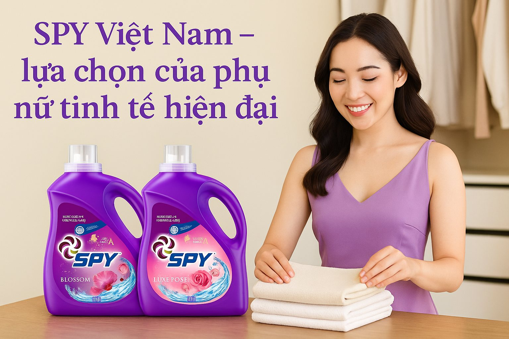

**(Trích báo Đời sống & Pháp luật)**

Người phụ nữ hiện đại không chỉ cần một sản phẩm giặt giũ sạch vết bẩn, mềm vải mà còn mong muốn hương thơm bền lâu, tinh tế như dấu ấn riêng. Hiểu điều đó, SPY Việt Nam mang đến Nước giặt xả SPY – giải pháp toàn diện, nâng tầm việc giặt giũ thành trải nghiệm chăm sóc mỗi ngày.

**Khác biệt làm nên sự tinh tế**

Điểm nổi bật của [Nước giặt xả SPY](https://www.facebook.com/giatxaSpy) nằm ở công thức giặt sạch sâu nhưng vẫn dịu nhẹ. Sản phẩm có khả năng đánh bay vết bẩn cứng đầu, đồng thời giữ cho vải mềm mại, dễ ủi, không bị thô cứng sau mỗi lần giặt. Lớp màng bảo vệ trên từng sợi vải còn giúp ngăn tái bám bụi bẩn và giữ màu sắc tươi mới, để mỗi chiếc áo, chiếc váy đều duy trì vẻ ngoài tinh tươm qua nhiều lần giặt.

Điểm đặc biệt của SPY nằm ở hương nước hoa Pháp sang trọng. Hương thơm bung tỏa theo từng cử động, vừa tinh tế, vừa bền lâu – đủ để trở thành “phụ kiện vô hình” giúp phụ nữ thêm tự tin trong mọi khoảnh khắc. Quần áo không chỉ sạch, mà còn mang một mùi hương riêng biệt, như lời khẳng định về phong cách sống.

**Trải nghiệm chăm sóc bản thân qua từng sợi vải**

Với nước giặt xả SPY, giặt giũ không chỉ dừng lại ở việc giữ cho trang phục sạch sẽ mà còn trở thành cách người phụ nữ trân trọng bản thân và yêu thương gia đình. Mỗi chiếc áo trắng tinh tươm được giặt ủi gọn gàng, phảng phất hương thơm là lời nhắn gửi yêu thương đến con trẻ trong ngày tựu trường. Từng bộ vest chỉn chu giúp người chồng thêm tự tin trong những cuộc họp quan trọng. Và hơn hết, chính họ - những người phụ nữ hiện đại - khi khoác lên mình những bộ cánh mềm mại, thoang thoảng mùi hương quyến rũ sẽ cảm nhận được sự tự tin cùng khí chất riêng biệt.

Giặt giũ, vốn thường được xem như một công việc lặp lại nhàm chán, nay được nâng tầm thành nghệ thuật của sự chăm sóc. SPY hiểu rằng phụ nữ hiện đại ngày nay không chỉ tìm kiếm sự hiệu quả mà còn mong muốn biến những khoảnh khắc đời thường thành trải nghiệm tinh tế mang đến những niềm hạnh phúc giản đơn nhưng đủ để khơi dậy niềm vui mỗi ngày.

**SPY - Biểu tượng của phong cách sống hiện đại**

Trong nhịp sống hối hả, phụ nữ ngày nay vừa làm việc, vừa chăm sóc gia đình, vừa phải giữ sự an yên trong tâm hồn. Chính trong hành trình ấy, SPY trở thành người bạn đồng hành - một giải pháp giặt giũ toàn diện, mang lại sự sạch sẽ tinh tươm, hương thơm cao cấp mà vẫn bảo vệ môi trường.

SPY không chỉ dừng lại ở vai trò của một sản phẩm chăm sóc quần áo mà còn là biểu tượng cho sự hiện đại, tinh tế. Sự hiện diện của SPY trong mỗi gia đình là lời khẳng định cho chất lượng bền vững. SPY là một lựa chọn thông minh, lựa chọn chất lượng, lựa chọn phong cách, lựa chọn gắn liền với trách nhiệm đối với cộng đồng và môi trường.

**Niềm tin từ thương hiệu uy tín**

Các sản sản phẩm thương hiệu SPY được nghiên cứu và sản xuất tại nhà máy xanh Công ty TNHH Komlife Việt Nam - doanh nghiệp hơn 15 năm kinh nghiệm trong ngành chăm sóc gia đình – SPY mang đến sự an tâm tuyệt đối. Từ khâu nghiên cứu đến quy trình kiểm soát chất lượng, tất cả đều được thực hiện nghiêm ngặt, vừa an toàn cho làn da nhạy cảm, vừa thân thiện với môi trường. Đây không chỉ là sản phẩm giặt giũ, mà còn là lựa chọn gắn liền với triết lý sống bền vững và nhân văn.

Với nước giặt xả SPY, việc giặt giũ không còn là công việc nội trợ thường ngày, mà trở thành cách phụ nữ chăm sóc chính mình và gửi gắm yêu thương đến gia đình. Sạch sâu – mềm mịn – thơm bền – an toàn, đó chính là lý do SPY Việt Nam trở thành lựa chọn của người phụ nữ tinh tế hiện đại.

Sự tự tin ấy đến từ chất lượng thật, từ cam kết bền vững và từ niềm tin vững chắc rằng người Việt hoàn toàn có thể tạo ra những sản phẩm đạt chuẩn quốc tế, chinh phục cả những người tiêu dùng khó tính nhất. SPY không chỉ phục vụ nhu cầu giặt giũ hằng ngày, mà còn góp phần lan tỏa hình ảnh về một Việt Nam sáng tạo, nhân văn và tràn đầy bản lĩnh.

**Trích từ bài viết “**[**SPY Việt Nam – Lựa chọn của phụ nữ tinh tế hiện đại**](https://doisongphapluat.com.vn/spy-viet-nam-lua-chon-cua-phu-nu-tinh-te-hien-dai-a695941.html)**”,** ***Báo Đời sống & Pháp luật*****, ngày 15/09/2025.**
