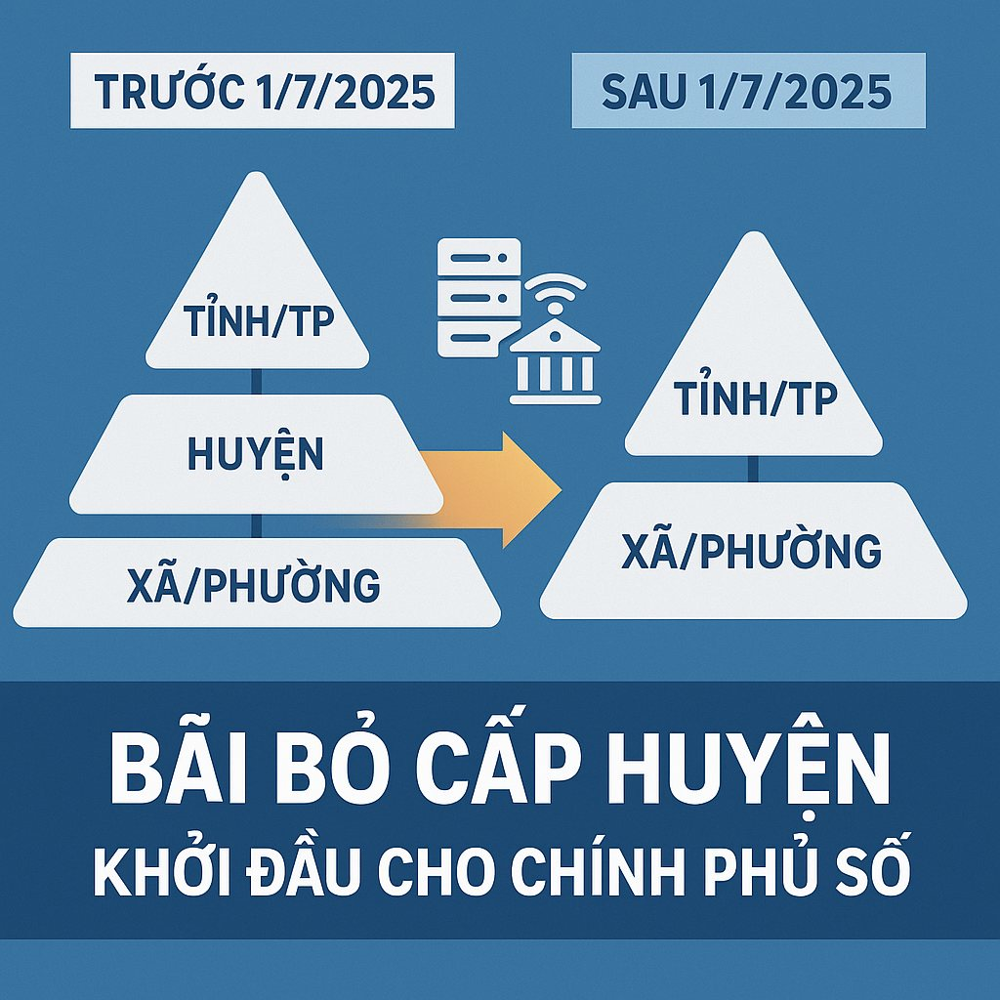
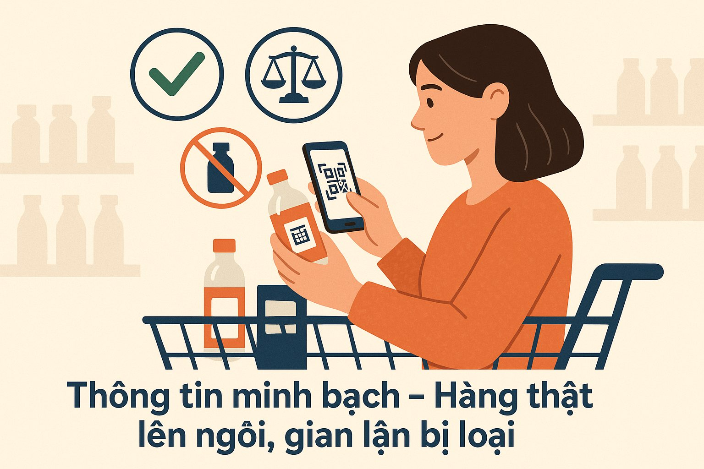
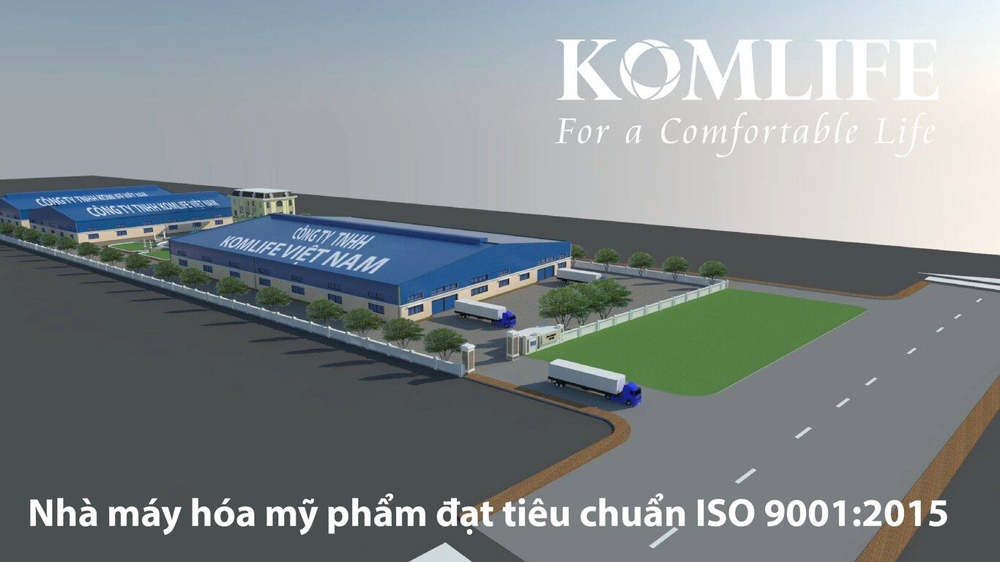

*Một góc nhìn toàn diện về cuộc chuyển mình lịch sử ngày 1/7/2025*

Ngày hôm nay chính thức mở ra một chương mới trong hành trình phát triển của Việt Nam. Hàng loạt chính sách cải cách mang tính đột phá đã chính thức có hiệu lực, không chỉ tái định hình bộ máy hành chính quốc gia, mà còn định vị lại vai trò của doanh nghiệp và quyền lực của người tiêu dùng trong nền kinh tế hiện đại.

## **Cải cách hành chính: Dứt khoát bước sang thời đại mới**

Từ hôm nay, Việt Nam chỉ còn hai cấp hành chính: **tỉnh/thành phố** và **xã/phường**, theo Nghị quyết 60-NQ/TW. Việc bãi bỏ cấp huyện được kỳ vọng giúp:

- Tinh gọn bộ máy, giảm hàng ngàn tỷ đồng chi phí vận hành mỗi năm
- Rút ngắn thời gian xử lý thủ tục
- Đẩy mạnh chính phủ số và quản trị minh bạch

Đây là một trong những cải cách mang tính "lột xác", mở đường cho Việt Nam bắt kịp làn sóng quản trị hiện đại trên thế giới.

**

***Cải cách hành chính - Khởi đầu cho chính phủ số***

## **Luật mới: Niềm tin trở thành một phần của pháp luật**

Song hành cùng hành chính, ba trụ cột pháp lý – **Luật Doanh nghiệp**, **Luật Bảo vệ người tiêu dùng** và **Luật Thuế sửa đổi** – cũng đồng loạt có hiệu lực. Một số điểm nổi bật:

- **Doanh nghiệp** buộc phải công khai thông tin sản phẩm, xuất xứ và chính sách hậu mãi
- **Người tiêu dùng** được tăng cường quyền tra cứu, đổi trả, và yêu cầu kiểm định
- **Thương mại điện tử** bị siết chặt nhằm ngăn chặn hàng giả, hàng kém chất lượng

Đây không chỉ là biện pháp bảo vệ người tiêu dùng, mà còn là áp lực cải tổ bắt buộc đối với toàn bộ hệ sinh thái doanh nghiệp – ai không minh bạch, sẽ bị đào thải.

**

**Không minh bạch sẽ bị đào thải**

## **Thời cơ hay áp lực cho doanh nghiệp Việt?**

Với doanh nghiệp nhỏ và vừa, thách thức là rõ ràng: phải thay đổi hoặc bị bỏ lại phía sau. Nhưng trong thách thức luôn ẩn giấu cơ hội:

- Doanh nghiệp tiên phong minh bạch sẽ **dễ dàng tiếp cận vốn, đối tác quốc tế**
- Được **ưu đãi về thuế và hỗ trợ đổi mới sáng tạo**
- Tăng **lòng tin của người tiêu dùng trong nước** và thị trường xuất khẩu

## **Komlife: 15 năm vững vàng – Sẵn sàng bứt phá**

Trong bối cảnh đó, **Komlife Việt Nam** như một hình mẫu doanh nghiệp biết nắm bắt xu hướng ngay từ những ngày đầu. Kỷ niệm 15 năm thành lập đúng vào thời điểm lịch sử này, Komlife đánh dấu cột mốc mới bằng loạt cam kết mạnh mẽ:

- **Nhà máy tại Hưng Yên** đạt chuẩn, vận hành theo mô hình nhà máy “Xanh”
- **Minh bạch thông tin sản phẩm** qua QR code truy xuất nguồn gốc
- **Cam kết “Mỗi sản phẩm – Một cam kết”** các sản phẩm do Komlife Việt Nam sản xuất đều đạt chất lượng cao, an toàn và thân thiện với người tiêu dùng.

Komlife không chỉ lớn mạnh về quy mô, mà còn trưởng thành trong cách làm thương hiệu: **bằng trách nhiệm, sự minh bạch và chiến lược phát triển bền vững**.

## ***Nhà máy sản xuất vận hành theo mô hình nhà máy "Xanh"***

## **Bức tranh kinh tế Việt Nam: Khởi đầu cho một chu kỳ tăng trưởng mới**

- Theo báo cáo mới nhất của Bộ Kế hoạch & Đầu tư, GDP quý II/2025 tăng trưởng 6,3%, cao hơn kỳ vọng và cho thấy tín hiệu phục hồi rõ nét.
- Khu vực nông thôn bắt đầu khởi sắc trở lại nhờ chính sách ưu đãi tín dụng và cải cách đất đai.
- Báo cáo của World Bank công bố tháng 6/2025 dự báo Việt Nam sẽ đạt mức tăng trưởng GDP 6,8% trong năm nay, với điều kiện tiếp tục giữ vững ổn định kinh tế vĩ mô và cải thiện môi trường đầu tư. Các tổ chức quốc tế đều đánh giá cao sự nhất quán trong chính sách điều hành và tầm nhìn cải cách hành chính của Việt Nam.

Tín hiệu phục hồi rõ ràng. Điều Việt Nam cần lúc này không phải là tốc độ, mà là **độ sâu và tính bền vững của cải cách**.

## **Ai sẽ dẫn đầu trong kỷ nguyên mới?**

Câu hỏi đặt ra không phải là "cải cách có hiệu quả không?" mà là: **Doanh nghiệp nào sẵn sàng thích ứng? Ai sẽ chủ động đổi mới? Ai sẽ trở thành hình mẫu của thế hệ doanh nghiệp Việt Nam mới?**

**Việt Nam đã đặt chân vào kỷ nguyên mới. Nhưng bứt phá hay bị bỏ lại – không nằm ở chính sách, mà nằm ở sự lựa chọn của từng doanh nghiệp, từng công dân.**

*“Đây không còn là thời đại của những doanh nghiệp lớn, mà là thời đại của những doanh nghiệp linh hoạt, minh bạch và có tầm nhìn.”*

Komlife, sau 15 năm, đang là minh chứng rõ ràng rằng doanh nghiệp Việt hoàn toàn có thể vươn lên bằng chính nỗ lực nội tại – nếu biết đi đúng hướng.
